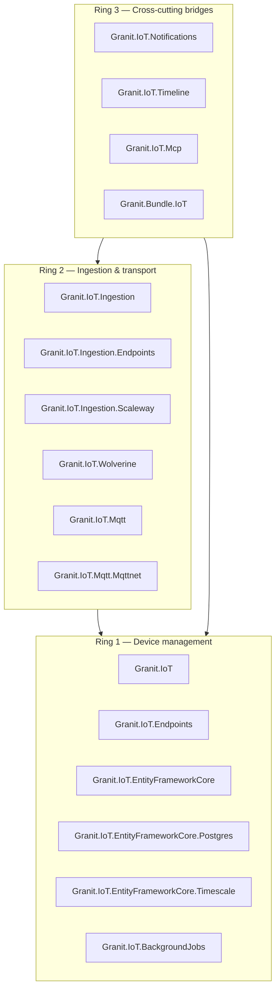
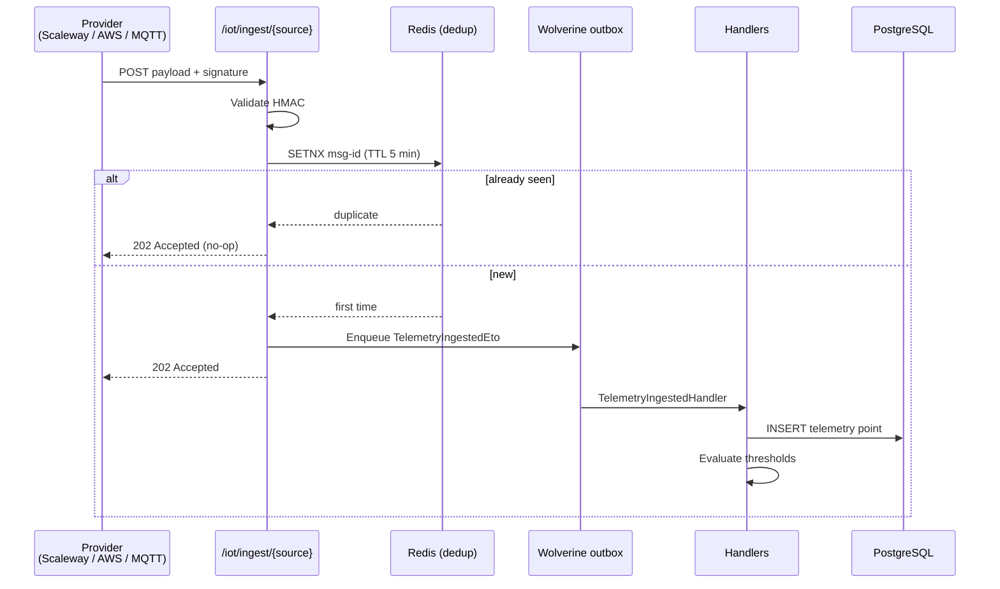

# Granit.IoT Architecture — Multi-Tenant IoT Platform for .NET

Granit.IoT is a modular IoT device management and telemetry ingestion platform
built on the [Granit framework](https://github.com/granit-fx/granit-dotnet) for
.NET 10. It ships 15 focused NuGet packages plus a meta-bundle, organized in
three cohesion rings, and gives B2B SaaS teams a production-ready foundation
to manage IoT devices, ingest sensor data, trigger alerts, and stay compliant
with GDPR and ISO 27001 — without rebuilding the plumbing.

## Why Granit.IoT exists — the problems it solves

Teams building IoT features on top of Granit repeatedly hit the same wall:

- **No standard device model.** Each app invents its own `Device` entity, its
  own lifecycle (provisioning, active, suspended, decommissioned), its own
  audit trail. Compliance reviews fail ISO 27001 because asset traceability
  is ad-hoc.
- **Telemetry ingestion is slow and fragile.** Webhooks block the HTTP thread,
  signature validation is forgotten, duplicate messages create double-alerts,
  and nothing survives a broker restart.
- **Multi-tenancy leaks.** A global `Devices` table without query filters
  eventually ships a bug that returns another tenant's data.
- **Time-series tables explode.** No retention policy, no partitioning, no
  purge job — a year of telemetry balloons to hundreds of millions of rows
  and queries slow to a crawl.
- **Each IoT provider is a re-integration.** Scaleway, AWS, Azure, bare MQTT —
  each ships a different envelope, a different signature scheme, a different
  SDK. Teams build provider-specific code that rots.
- **Alerting and audit trail live in silos.** Threshold alerts don't land in
  the same notification UI as the rest of the platform. Device state changes
  aren't visible in the `Granit.Timeline` audit chatter.

Granit.IoT fixes all of the above with opinionated defaults and Granit-native
integrations.

## Package rings

Packages are grouped in three rings; each ring depends only on itself and
inner rings. This is enforced by architecture tests — Ring 2 **cannot** reach
into Ring 3.

### Ring 1 — Device management

The core domain and its persistence. No network I/O, no external providers.

| Package | Purpose |
| --- | --- |
| [`Granit.IoT`](../src/Granit.IoT/README.md) | `Device` aggregate, `TelemetryPoint` entity, value objects, CQRS reader/writer abstractions, domain events, OpenTelemetry diagnostics |
| [`Granit.IoT.Endpoints`](../src/Granit.IoT.Endpoints/README.md) | Minimal API route group `/iot/devices` + `/iot/telemetry` with permissions, FluentValidation, tenant scoping |
| [`Granit.IoT.EntityFrameworkCore`](../src/Granit.IoT.EntityFrameworkCore/README.md) | `IoTDbContext`, EF Core configurations, reader/writer implementations with named query filters |
| [`Granit.IoT.EntityFrameworkCore.Postgres`](../src/Granit.IoT.EntityFrameworkCore.Postgres/README.md) | PostgreSQL-specific migrations: BRIN index on `recorded_at`, GIN index on `metrics` JSONB, RANGE partitioning helpers |
| [`Granit.IoT.EntityFrameworkCore.Timescale`](../src/Granit.IoT.EntityFrameworkCore.Timescale/README.md) | Opt-in TimescaleDB backend: hypertable conversion, hourly/daily continuous aggregates, reader that routes on window size |
| [`Granit.IoT.BackgroundJobs`](../src/Granit.IoT.BackgroundJobs/) | Recurring jobs: stale telemetry purge, device heartbeat timeout, monthly partition maintenance |

### Ring 2 — Ingestion & transport

Everything that turns raw provider payloads into normalized domain events.

| Package | Purpose |
| --- | --- |
| [`Granit.IoT.Ingestion`](../src/Granit.IoT.Ingestion/README.md) | Provider-agnostic pipeline: signature validation → parsing → deduplication (Redis) → outbox dispatch |
| [`Granit.IoT.Ingestion.Endpoints`](../src/Granit.IoT.Ingestion.Endpoints/README.md) | `POST /iot/ingest/{source}` returning `202 Accepted` |
| [`Granit.IoT.Ingestion.Scaleway`](../src/Granit.IoT.Ingestion.Scaleway/README.md) | Scaleway IoT Hub provider — HMAC-SHA256 + JSON envelope parser |
| [`Granit.IoT.Wolverine`](../src/Granit.IoT.Wolverine/README.md) | Wolverine handlers for telemetry persistence and threshold evaluation |
| [`Granit.IoT.Mqtt`](../src/Granit.IoT.Mqtt/README.md) | MQTT broker abstractions (connection, topic subscription, QoS) |
| [`Granit.IoT.Mqtt.Mqttnet`](../src/Granit.IoT.Mqtt.Mqttnet/README.md) | MQTTnet implementation — connect to any MQTT 3.1.1 / 5.0 broker |

### Ring 3 — Cross-cutting bridges

Thin adapters that connect IoT events to other Granit modules. Each bridge is
opt-in — the core ingestion pipeline works without them.

| Package | Purpose |
| --- | --- |
| [`Granit.IoT.Notifications`](../src/Granit.IoT.Notifications/README.md) | Bridge to `Granit.Notifications`: threshold alerts, device-offline alerts, per-tenant settings |
| [`Granit.IoT.Timeline`](../src/Granit.IoT.Timeline/) | Bridge to `Granit.Timeline`: device lifecycle events become audit chatter entries |
| [`Granit.IoT.Mcp`](../src/Granit.IoT.Mcp/README.md) | Bridge to `Granit.Mcp.Server`: exposes `IDeviceReader` and `ITelemetryReader` as MCP tools for AI assistants, tenant-scoped |
| [`Granit.Bundle.IoT`](../src/bundles/Granit.Bundle.IoT/README.md) | Meta-package — one `builder.AddIoT()` call enables the full stack (MQTT is opt-in, added separately) |

## Provider support

Granit.IoT decouples the ingestion pipeline from provider-specific payload
shapes. Adding a new cloud provider means implementing
`IIngestionSignatureValidator` and `IIngestionParser` — the pipeline, outbox,
deduplication, threshold evaluation, and bridges stay the same.

| Provider | Package | Status | Notes |
| --- | --- | --- | --- |
| **Scaleway IoT Hub** | `Granit.IoT.Ingestion.Scaleway` | Available | HMAC-SHA256 signature (`X-Scaleway-Signature`), JSON envelope with Base64 payloads, configurable MQTT topic pattern for serial extraction |
| **AWS IoT Core** | `Granit.IoT.Ingestion.Aws` | Planned | SNS + direct HTTP + API Gateway variants; AWS SigV4 validation ([#35](https://github.com/granit-fx/granit-iot/issues/35)) |
| **AWS provisioning / shadow / jobs** | `Granit.IoT.Aws` | Planned | Device provisioning, device shadows, fleet jobs ([#36](https://github.com/granit-fx/granit-iot/issues/36)) |
| **MQTT (any broker)** | `Granit.IoT.Mqtt` + `Granit.IoT.Mqtt.Mqttnet` | Available | Works with Mosquitto, EMQX, HiveMQ, Scaleway IoT Hub in MQTT mode, or self-hosted brokers |

> [!NOTE]
> AWS packages are tracked in the Phase 1 MVP AWS issue ([#35](https://github.com/granit-fx/granit-iot/issues/35))
> and Phase 2 full AWS device integration ([#36](https://github.com/granit-fx/granit-iot/issues/36)).
> Until they ship, an AWS SaaS can still use Granit.IoT by forwarding IoT Core
> messages to the generic MQTT bridge.

## Key design decisions

### JSONB telemetry model — one row per payload

Each `TelemetryPoint` stores the full device payload as a single PostgreSQL
`jsonb` column (`Metrics`). A thermometer message `{temp: 22.5, humidity: 45}`
is **one row**, not two. A GIN index on `Metrics` enables per-metric queries.

**Why not EAV?** Entity-Attribute-Value tables explode in row count, require
joins for every read, and make per-device query plans unpredictable.

**Why not columnar?** Device payloads are heterogeneous — sensor A emits
`{temp, humidity}`, sensor B emits `{pressure, battery, rssi}`. A fixed
columnar layout forces nullable columns or parallel tables.

### 202 Accepted + Wolverine outbox

Ingestion endpoints return `202 Accepted` as soon as the signature is valid
and the message is deduplicated. Persistence and threshold evaluation happen
asynchronously via Wolverine's transactional outbox.

This decouples HTTP latency from database latency. P99 ingestion stays
under 1 second even when the database is under load.

### Transport-level deduplication

The Redis dedup key is the **transport message ID** (`X-Scaleway-Message-Id`,
MQTT packet identifier, AWS SNS message ID) — not the business key. The
5-minute TTL is enough to catch retry storms without growing the Redis
working set.

### Multi-tenancy from day one

Every persisted entity implements `IMultiTenant`. `ApplyGranitConventions`
adds a named query filter on `TenantId` to every query — a tenant can never
see another tenant's devices or telemetry. The only way around the filter
is `.IgnoreQueryFilters()`, used intentionally by background jobs scanning
across tenants.

### PostgreSQL-native time series (BRIN + partitioning)

Rather than introduce TimescaleDB on day one, Granit.IoT leans on PostgreSQL's
native features:

- **BRIN index** on `recorded_at` — an order of magnitude smaller than a
  B-tree for append-only time-series data
- **GIN index** on `metrics` JSONB — fast per-metric filters and aggregations
- **Monthly RANGE partitioning** — `TelemetryPartitionMaintenanceJob`
  provisions the next two months every Sunday at 01:00

TimescaleDB support is available (Phase 3) as an opt-in backend via
[`Granit.IoT.EntityFrameworkCore.Timescale`](../src/Granit.IoT.EntityFrameworkCore.Timescale/README.md) —
hypertable conversion + hourly/daily continuous aggregates. Teams past ~100M
rows/day should adopt it; everyone else stays on the default backend. See
the [TimescaleDB guide](timescaledb.md) for the adoption decision tree.

### No separate rules engine, no new notification infrastructure

Device state transitions use `Granit.Workflow` (the same engine the rest of
the framework uses). Threshold alerts land in `Granit.Notifications` via a
thin bridge. Audit entries land in `Granit.Timeline` via another thin bridge.
Granit.IoT never duplicates infrastructure that already exists elsewhere in
the framework.

## Security model

| Surface | Mitigation |
| --- | --- |
| Inbound webhooks | HMAC-SHA256 signature validated **before** any DB access |
| Rate limiting | Per-tenant limits via `Granit.RateLimiting` |
| Device credentials | Encrypted at rest via `Granit.Encryption`; `[SensitiveData]` attribute prevents serialization in API responses |
| Audit trail | `FullAuditedAggregateRoot` — `CreatedBy`, `ModifiedBy`, `DeletedBy` on every `Device` (ISO 27001 asset traceability) |
| Multi-tenant isolation | Named query filter on `TenantId`, enforced at EF Core level; architecture tests forbid raw `DbContext` usage from endpoint handlers |

## Compliance — GDPR & ISO 27001

- **Right to erasure.** `StaleTelemetryPurgeJob` bulk-deletes via the
  `(tenant_id, recorded_at)` index. Partition drops are O(1) at month
  boundaries.
- **Retention.** Per-tenant retention via `Granit.Settings`
  (`IoT:TelemetryRetentionDays`, default 365).
- **Audit trail.** Device lifecycle (provision, activate, suspend,
  reactivate, decommission) is mirrored into `Granit.Timeline` system-log
  entries — every change is attributable to a user or service.
- **Data residency.** Granit.IoT does not send telemetry outside the host
  application's database. Provider webhooks terminate at the application's
  own ingestion endpoint.

## Next steps

- **Start here**: [Getting started](getting-started.md) — provision a device
  and receive your first Scaleway telemetry in under 5 minutes.
- **Per-topic deep dives**: [Device management](device-management.md),
  [Telemetry ingestion](telemetry-ingestion.md), [MQTT](mqtt.md),
  [Operational hardening](operational-hardening.md),
  [Notifications bridge](notifications-bridge.md),
  [Timeline bridge](timeline-bridge.md), [Bundle](bundle.md).
- **Contribute**: issues and RFCs at
  [github.com/granit-fx/granit-iot](https://github.com/granit-fx/granit-iot).
