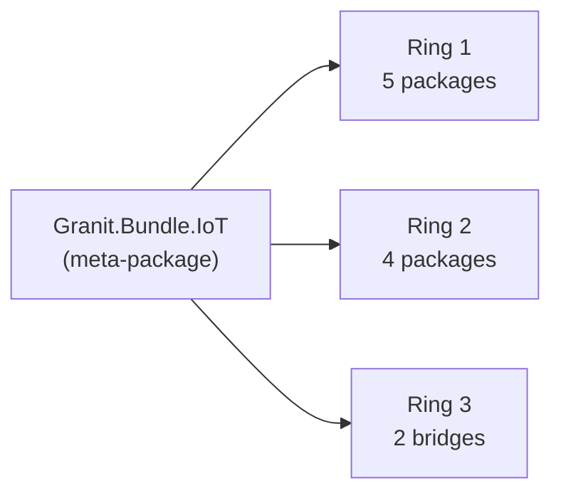

# Granit.Bundle.IoT — One Package, Full IoT Stack

The Granit.Bundle.IoT meta-package ships the full Granit.IoT stack as a
single NuGet dependency and a single `builder.AddIoT()` call. Teams can
onboard IoT device management, Scaleway telemetry ingestion, threshold
alerts, background jobs, and the timeline audit trail without hand-picking
11 packages.

## When to use the bundle

Use `Granit.Bundle.IoT` when:

- You want the full Phase-1 / Phase-2 IoT stack wired up with sensible defaults
- You're starting a new greenfield Granit application
- You don't need to cherry-pick a subset (e.g. ingestion without endpoints)

Use individual packages when:

- You only need the domain (tests, shared libraries)
- You want to swap the EF Core layer for a custom persistence adapter
- You're integrating with an alternative web framework that doesn't use Minimal API

## What's inside

| # | Package | Ring | Role |
| --- | --- | --- | --- |
| 1 | `Granit.IoT` | 1 | Domain, value objects, events, CQRS abstractions |
| 2 | `Granit.IoT.EntityFrameworkCore` | 1 | `IoTDbContext`, EF Core configurations |
| 3 | `Granit.IoT.EntityFrameworkCore.Postgres` | 1 | PostgreSQL migrations (BRIN, GIN, partitioning) |
| 4 | `Granit.IoT.Endpoints` | 1 | Device CRUD + telemetry queries |
| 5 | `Granit.IoT.BackgroundJobs` | 1 | Purge, heartbeat, partition maintenance |
| 6 | `Granit.IoT.Ingestion` | 2 | Provider-agnostic ingestion pipeline |
| 7 | `Granit.IoT.Ingestion.Endpoints` | 2 | `POST /iot/ingest/{source}` webhook |
| 8 | `Granit.IoT.Ingestion.Scaleway` | 2 | Scaleway IoT Hub provider |
| 9 | `Granit.IoT.Wolverine` | 2 | Wolverine handlers + threshold evaluation |
| 10 | `Granit.IoT.Notifications` | 3 | Bridge to `Granit.Notifications` |
| 11 | `Granit.IoT.Timeline` | 3 | Bridge to `Granit.Timeline` |



**Not included** — these are opt-in:

- `Granit.IoT.Mqtt` + `Granit.IoT.Mqtt.Mqttnet` — add only if you need
  a non-Scaleway MQTT broker. See [MQTT](mqtt.md).
- Phase 3 packages (`AI.Mcp`, `TimescaleDB`, `AWS`) — not yet released.

## Installation

```bash
dotnet add package Granit.Bundle.IoT
```

This single reference transitively pulls in all 11 bundled packages. No
dependency conflicts — every package in the bundle targets the same
`Granit.*` framework version pinned in `Directory.Packages.props`.

## Registration

```csharp
using Granit.Bundle.IoT;

builder.Services
    .AddGranit(builder.Configuration)
    .AddIoT();

app.MapGranitIoTEndpoints();          // /iot/devices + /iot/telemetry
app.MapGranitIoTIngestionEndpoints(); // /iot/ingest/{source}
```

`AddIoT()` enumerates the 11 modules in topological order. Actual DI
registration order is driven by each module's own `[DependsOn(...)]`
graph — the bundle's enumeration is just a complete list, so dependency
order is never a concern.

## What you get out of the box

After `AddIoT()`:

- Device CRUD endpoints at `/iot/devices` (with permissions, FluentValidation, OpenAPI)
- Telemetry query endpoints at `/iot/telemetry/{deviceId}`
- Scaleway webhook at `/iot/ingest/scaleway` (with HMAC + Redis dedup + Wolverine outbox)
- Three recurring background jobs (purge, heartbeat, partition maintenance)
- Two notification types (threshold alert + device offline) auto-registered
- Device lifecycle → timeline audit chatter
- OpenTelemetry metrics for every stage (see
  [Observability in Operational hardening](operational-hardening.md#observability))

## Breaking down the bundle if you need to

If the bundle is "too much," register only what you need — each module's
`DI extension is public:

```csharp
builder.Services
    .AddGranitIoT()                       // domain only
    .AddGranitIoTEntityFrameworkCore()    // persistence
    .AddGranitIoTEndpoints();             // CRUD API
// skip ingestion / wolverine / jobs / bridges
```

The module system enforces the ring discipline — you can't accidentally
register a Ring 3 bridge without its Ring 2 producer. Architecture tests
catch violations at build time.

## Versioning

The bundle version tracks the Granit.IoT release cycle. Pre-release
(pre-`v1.0.0`), breaking changes land in minor versions; post-`v1.0.0`,
SemVer applies strictly.

| Granit.IoT version | Granit framework version | .NET | EF Core |
| --- | --- | --- | --- |
| `0.x` (current) | `1.0.x` | 10.0 | 10 |

Check the [releases page](https://github.com/granit-fx/granit-iot/releases)
for the current compatibility matrix.

## See also

- [Getting started](getting-started.md) — 5-minute quickstart using the bundle
- [Architecture](architecture.md) — ring structure and design decisions
- [MQTT](mqtt.md) — the one package group **not** in the bundle (opt-in)
- [Epic #1](https://github.com/granit-fx/granit-iot/issues/1) — full roadmap including Phase 3 packages
