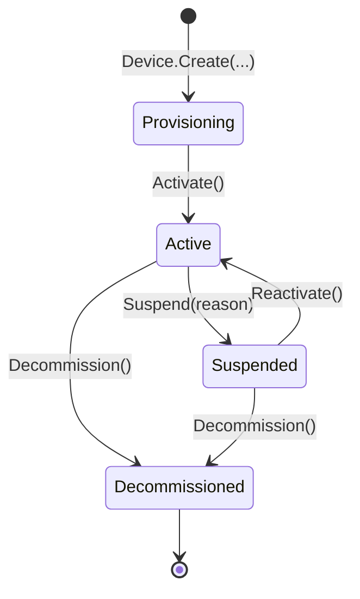

# IoT Device Management in .NET — Granit.IoT Domain, Endpoints & Persistence

Manage the full lifecycle of IoT devices in a multi-tenant .NET 10 application:
DDD aggregate with enforced state transitions, CQRS reader/writer split,
Minimal API CRUD, and a PostgreSQL schema tuned for time-series telemetry.
This guide covers Ring 1 of Granit.IoT — `Granit.IoT`, `Granit.IoT.Endpoints`,
`Granit.IoT.EntityFrameworkCore`, and `Granit.IoT.EntityFrameworkCore.Postgres`.

## The problems Ring 1 solves

Without a shared device model, every team rebuilds the same plumbing — and
most rebuilds leak in one of four ways:

- **Ad-hoc lifecycle.** Devices jump straight from "new" to "broken" with
  no audit trail of who suspended them or why. ISO 27001 asset traceability
  fails the next audit.
- **Leaky multi-tenancy.** A missing `WHERE tenant_id = @t` eventually
  returns another customer's devices. The fix is not discipline, it's a
  named query filter.
- **Credentials in the response body.** Device secrets end up serialized
  into JSON responses or OpenAPI examples.
- **Slow telemetry queries.** A B-tree on `recorded_at` grows unbounded;
  GDPR erasure becomes a multi-minute `DELETE`.

Ring 1 fixes all of this by shipping a domain model with private setters, a
state machine enforced in code, `[SensitiveData]` on the credential, and
time-series indexes (BRIN + GIN + partitioning) as first-class PostgreSQL
migration helpers.

## Package overview

| Package | Purpose |
| --- | --- |
| [`Granit.IoT`](../src/Granit.IoT/README.md) | Domain, value objects, events, CQRS interfaces, diagnostics |
| [`Granit.IoT.Endpoints`](../src/Granit.IoT.Endpoints/README.md) | Minimal API `/iot/devices` and `/iot/telemetry` with permissions |
| [`Granit.IoT.EntityFrameworkCore`](../src/Granit.IoT.EntityFrameworkCore/README.md) | `IoTDbContext`, EF Core configurations, reader/writer implementations |
| [`Granit.IoT.EntityFrameworkCore.Postgres`](../src/Granit.IoT.EntityFrameworkCore.Postgres/README.md) | PostgreSQL migration helpers (BRIN, GIN, JSONB, RANGE partitioning) |

## Device — the central aggregate

`Device` is a `FullAuditedAggregateRoot` implementing `IMultiTenant`,
`IWorkflowStateful`, and `ITimelined`. All mutations go through methods —
every property has a `private set`, enforced by architecture tests.

### Lifecycle state machine



Each transition raises a domain event (`DeviceProvisionedEvent`,
`DeviceActivatedEvent`, `DeviceSuspendedEvent`, `DeviceReactivatedEvent`,
`DeviceDecommissionedEvent`) consumed locally by handlers. Cross-boundary
events use the `*Eto` (Event Transport Object) suffix — for example
`DeviceProvisionedEto`, which carries the minimal shape needed by the
integration bus.

### Mutating methods

```csharp
public static Device Create(
    Guid id, Guid? tenantId,
    DeviceSerialNumber serialNumber, HardwareModel model, FirmwareVersion firmware,
    string? label = null, DeviceCredential? credential = null);

public void Activate();
public void Suspend(string reason);
public void Reactivate();
public void Decommission();
public void UpdateFirmware(FirmwareVersion firmware);
public void UpdateLabel(string? label);
public void UpdateCredential(DeviceCredential? credential);
public void RecordHeartbeat(DateTimeOffset timestamp);
```

Illegal transitions throw — `device.Activate()` on a `Decommissioned`
device fails with a clear domain exception, not a silent no-op.

### Value objects

| Type | Base | Validation |
| --- | --- | --- |
| `DeviceSerialNumber` | `SingleValueObject<string>` | Uppercase alphanumeric + dash, length-bounded |
| `HardwareModel` | `SingleValueObject<string>` | Non-empty, length-bounded |
| `FirmwareVersion` | `SingleValueObject<string>` | Semver-like, length-bounded |
| `DeviceCredential` | `ValueObject` | `CredentialType` + `ProtectedSecret` (`[SensitiveData]`) |
| `MetricName` | `SingleValueObject<string>` | Dot-notation, lowercase, max 10 segments |

`DeviceCredential.ProtectedSecret` carries the `[SensitiveData]` attribute:
`Granit.Http.Sanitization` scrubs it from logs, OpenAPI schemas, and
validation-error payloads.

## CQRS reader / writer split

The reader and writer interfaces are **never merged** into a `*Store`.
Readers query with `AsNoTracking()`; writers mutate; heartbeat updates
bypass the full aggregate load via `ExecuteUpdateAsync`.

```csharp
public interface IDeviceReader
{
    Task<Device?> FindAsync(Guid id, CancellationToken ct = default);
    Task<Device?> FindBySerialNumberAsync(string serialNumber, CancellationToken ct = default);
    Task<IReadOnlyList<Device>> ListAsync(DeviceStatus? status, int skip, int take, CancellationToken ct = default);
    Task<int> CountAsync(DeviceStatus? status, CancellationToken ct = default);
    Task<bool> ExistsAsync(string serialNumber, CancellationToken ct = default);
    Task<IReadOnlyList<Guid?>> GetDistinctTenantIdsAsync(CancellationToken ct = default);
    Task<IReadOnlyList<Device>> FindStaleAsync(
        IReadOnlyCollection<Guid?> tenantIds,
        DateTimeOffset lastHeartbeatBefore,
        int batchSize,
        CancellationToken ct = default);
}

public interface IDeviceWriter
{
    Task AddAsync(Device device, CancellationToken ct = default);
    Task UpdateAsync(Device device, CancellationToken ct = default);
    Task DeleteAsync(Device device, CancellationToken ct = default);
    Task UpdateHeartbeatAsync(Guid deviceId, DateTimeOffset timestamp, CancellationToken ct = default);
}
```

`UpdateHeartbeatAsync` emits a single `UPDATE iot_devices SET last_heartbeat_at = $1 WHERE id = $2`
via EF Core 10 bulk update — **no `SELECT` round-trip**. At 100k devices
publishing every 10 minutes, this keeps the write path predictable.

`FindStaleAsync` is the multi-tenant batch signature consumed by
`DeviceHeartbeatTimeoutJob` — it bypasses the tenant query filter via
`IgnoreQueryFilters()` and uses `WHERE tenant_id = ANY(@list)`.

## Minimal API — `/iot/devices`

`Granit.IoT.Endpoints` maps the following routes via `MapGranitIoTEndpoints()`:

| Method | Route | Permission | Returns |
| --- | --- | --- | --- |
| `GET` | `/iot/devices` | `IoT.Devices.Read` | `200 Ok` — `IReadOnlyList<DeviceResponse>` |
| `GET` | `/iot/devices/{id}` | `IoT.Devices.Read` | `200 Ok` / `404` |
| `POST` | `/iot/devices` | `IoT.Devices.Manage` | `201 Created` — `DeviceResponse` |
| `PUT` | `/iot/devices/{id}` | `IoT.Devices.Manage` | `200 Ok` |
| `DELETE` | `/iot/devices/{id}` | `IoT.Devices.Manage` | `204 No Content` / `409` when still `Active` |

### Request / response shapes

```csharp
public sealed record DeviceProvisionRequest
{
    public required string SerialNumber { get; init; }
    public required string HardwareModel { get; init; }
    public required string FirmwareVersion { get; init; }
    public string? Label { get; init; }
}

public sealed record DeviceUpdateRequest
{
    public string? FirmwareVersion { get; init; }
    public string? Label { get; init; }
}

public sealed record DeviceResponse(
    Guid Id,
    string SerialNumber,
    string HardwareModel,
    string FirmwareVersion,
    string Status,
    string? Label,
    DateTimeOffset? LastHeartbeatAt,
    DateTimeOffset CreatedAt,
    DateTimeOffset? ModifiedAt);
```

FluentValidation auto-filters requests at the route group level — a malformed
`SerialNumber` is rejected with `422 Unprocessable Entity` before your handler
runs. `DeviceCredential.ProtectedSecret` is never serialized back to the
client.

## Telemetry query endpoints — `/iot/telemetry`

| Method | Route | Permission | Notes |
| --- | --- | --- | --- |
| `GET` | `/iot/telemetry/{deviceId}` | `IoT.Telemetry.Read` | Time-range query, `maxPoints` 1-10000 |
| `GET` | `/iot/telemetry/{deviceId}/latest` | `IoT.Telemetry.Read` | Most recent value per metric key |
| `GET` | `/iot/telemetry/{deviceId}/aggregate` | `IoT.Telemetry.Read` | Server-side `Avg` / `Min` / `Max` / `Count` |

All three delegate to `ITelemetryReader`; aggregates are computed in PostgreSQL
via `(metrics->>'<key>')::float`, not loaded into memory.

Cross-tenant access returns `404 Not Found` — existence of another tenant's
device is never leaked.

## TelemetryPoint — append-only ledger

`TelemetryPoint` is a `CreationAuditedEntity`, never an aggregate. A single
device payload (`{temp: 22.5, humidity: 45, battery: 90}`) is **one row** with
the three metrics in the `metrics` JSONB column.

```csharp
public static TelemetryPoint Create(
    Guid id, Guid deviceId, Guid? tenantId,
    DateTimeOffset recordedAt,
    IReadOnlyDictionary<string, double> metrics,
    string? messageId, string? source);
```

Why JSONB-per-payload instead of EAV?

- 1 row vs N rows per payload — 3-10x smaller storage
- One index lookup per query instead of N joins
- Writes don't need a transaction to keep multi-metric payloads atomic
- GIN index on `metrics` still allows per-key filters:
  `WHERE metrics @> '{"temperature": 22.5}'`

## IoTDbContext — isolated schema

Granit.IoT ships its own `DbContext`. No shared context across modules — this
keeps migrations independent and architecture tests enforceable.

```csharp
public sealed class IoTDbContext : DbContext
{
    public DbSet<Device> Devices => Set<Device>();
    public DbSet<TelemetryPoint> TelemetryPoints => Set<TelemetryPoint>();
}
```

All tables are prefixed `iot_` (`iot_devices`, `iot_telemetry_points`).
Query filters for multi-tenancy and soft-delete are applied via
`modelBuilder.ApplyGranitConventions(currentTenant, dataFilter)` at the end of
`OnModelCreating` — the same pattern used everywhere else in Granit.

### Indexes (created by the initial EF migration)

| Table | Index | Purpose |
| --- | --- | --- |
| `iot_devices` | `UNIQUE (tenant_id, serial_number)` | Enforce per-tenant serial uniqueness |
| `iot_devices` | `(tenant_id, status)` | Filter by status within a tenant |
| `iot_telemetry_points` | `(device_id, recorded_at DESC)` | Covering index for the most common query |
| `iot_telemetry_points` | `(tenant_id, recorded_at)` | GDPR bulk erasure + per-tenant purge |

## PostgreSQL-specific helpers — `Granit.IoT.EntityFrameworkCore.Postgres`

This package ships `MigrationBuilder` extension methods for indexes and
partitioning that EF Core cannot emit declaratively.

```csharp
migrationBuilder.CreateTelemetryBrinIndex();        // BRIN(recorded_at)
migrationBuilder.CreateTelemetryGinIndex();         // GIN(metrics jsonb_ops)
migrationBuilder.CreateIoTPostgresIndexes();        // BRIN + GIN in one call
migrationBuilder.EnableTelemetryPartitioning();     // Convert to RANGE-partitioned
migrationBuilder.CreateTelemetryPartition(2026, 5); // iot_telemetry_points_2026_05
```

A BRIN index on `recorded_at` is an order of magnitude smaller than a B-tree
for append-only time-series data — critical at hundreds of millions of rows.

See [Operational hardening](operational-hardening.md) for partitioning
setup and the `TelemetryPartitionMaintenanceJob` that keeps future
partitions provisioned.

## Permissions

Declared in `IoTPermissions`:

| Key | Granted action |
| --- | --- |
| `IoT.Devices.Read` | List and retrieve devices |
| `IoT.Devices.Manage` | Provision, update, decommission |
| `IoT.Telemetry.Read` | Query telemetry and aggregates |

The permission definition provider is auto-discovered by
`Granit.Authorization` — no manual registration required.

## Anti-patterns to avoid

> [!WARNING]
> **Don't query `IoTDbContext` directly from endpoint handlers.** Always go
> through `IDeviceReader` / `ITelemetryReader`. Architecture tests fail CI
> if a handler references the context.

> [!WARNING]
> **Don't expose `Device` entities in responses.** Use `DeviceResponse`.
> Returning the entity leaks `Credential` (even scrubbed by `[SensitiveData]`,
> it's still a bad habit) and tightly couples your API to your persistence
> model.

> [!WARNING]
> **Don't load the full aggregate to update `LastHeartbeatAt`.** Use
> `IDeviceWriter.UpdateHeartbeatAsync(id, timestamp)` — a single
> `ExecuteUpdateAsync` call with no change tracking.

## See also

- [Getting started](getting-started.md) — 5-minute quickstart
- [Telemetry ingestion](telemetry-ingestion.md) — how telemetry actually lands in the table
- [Operational hardening](operational-hardening.md) — partitioning, purge, heartbeat
- [Timeline bridge](timeline-bridge.md) — device lifecycle events as audit chatter
- [Architecture](architecture.md) — ring structure and design decisions
