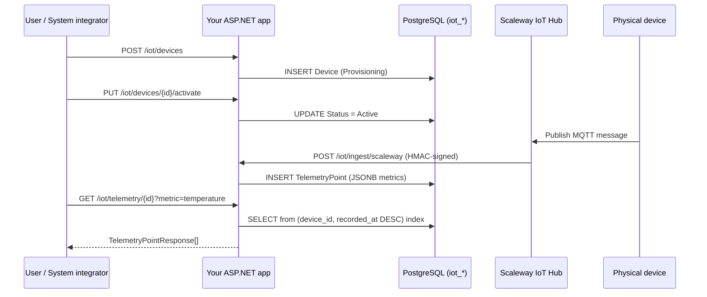

# Getting Started with Granit.IoT — 5-Minute Quickstart

Ship a multi-tenant IoT device management and telemetry ingestion stack on
.NET 10 in under five minutes. This guide walks you through installing the
`Granit.Bundle.IoT` meta-package, wiring Scaleway IoT Hub as your telemetry
source, provisioning a device, and querying its sensor data — end to end.

## What you'll build

By the end of this page, your ASP.NET Core application will:

- Expose `GET|POST|PUT|DELETE /iot/devices` for device management
- Expose `GET /iot/telemetry/{deviceId}` for time-range telemetry queries
- Expose `POST /iot/ingest/scaleway` as a webhook for Scaleway IoT Hub
- Persist devices and telemetry in an isolated PostgreSQL schema
  (`iot_devices`, `iot_telemetry_points`)
- Deduplicate incoming messages via Redis (5-minute TTL)
- Route threshold alerts through `Granit.Notifications`
- Log every device lifecycle event into `Granit.Timeline`



## Prerequisites

- [.NET 10 SDK](https://dotnet.microsoft.com/download/dotnet/10.0)
- [PostgreSQL 16+](https://www.postgresql.org/) — local or managed (OVH, RDS, Scaleway)
- [Redis 7+](https://redis.io/) — for transport-level deduplication
- An existing Granit host application (see the
  [Granit framework quickstart](https://github.com/granit-fx/granit-dotnet))
- [Docker](https://docs.docker.com/get-docker/) for integration tests
- Access to the
  [Granit GitHub Packages](https://github.com/orgs/granit-fx/packages) NuGet feed

## Step 1 — Configure the Granit NuGet feed

Granit.IoT packages are published to GitHub Packages. Authenticate once
with a personal access token that has the `read:packages` scope:

```bash
dotnet nuget update source granit-registry \
  --username YOUR_GITHUB_USERNAME \
  --password YOUR_GITHUB_PAT \
  --store-password-in-clear-text \
  --configfile nuget.config
```

> [!CAUTION]
> Never commit your PAT. Use `.gitignore` on `nuget.config` when it contains
> credentials, or inject the token at CI time via
> `NUGET_AUTH_TOKEN` + a dynamic feed source.

## Step 2 — Install the bundle

Add a single NuGet reference to your host project:

```bash
dotnet add package Granit.Bundle.IoT
```

This pulls in the 11 core packages: domain, EF Core persistence, PostgreSQL
migrations, device CRUD endpoints, ingestion pipeline, Scaleway provider,
Wolverine handlers, notifications bridge, background jobs, and the
timeline bridge.

> [!NOTE]
> MQTT support (`Granit.IoT.Mqtt` + `Granit.IoT.Mqtt.Mqttnet`) is opt-in —
> add it only if you need to consume from a non-Scaleway MQTT broker.
> See the [MQTT guide](mqtt.md).

## Step 3 — Register the modules

In your `Program.cs`, chain `.AddIoT()` onto the existing Granit builder:

```csharp
using Granit.Bundle.IoT;

WebApplicationBuilder builder = WebApplication.CreateBuilder(args);

builder.Services
    .AddGranit(builder.Configuration)
    .AddIoT();

WebApplication app = builder.Build();

app.MapGranitIoTEndpoints();          // /iot/devices + /iot/telemetry
app.MapGranitIoTIngestionEndpoints(); // /iot/ingest/{source}

app.Run();
```

`AddIoT()` registers all 11 bundled modules in topological order.
Each module's own `[DependsOn]` graph drives actual DI initialization — the
bundle is just a complete enumeration, so you can't accidentally skip a
dependency.

## Step 4 — Configure PostgreSQL, Redis, and Scaleway

Add the following to your `appsettings.json` (values shown are examples —
never commit real secrets):

```json
{
  "ConnectionStrings": {
    "Default": "Host=localhost;Database=granit;Username=granit;Password=__FROM_SECRET_STORE__",
    "Redis": "localhost:6379"
  },
  "IoT": {
    "TelemetryRetentionDays": 365,
    "HeartbeatTimeoutMinutes": 15,
    "Ingestion": {
      "Scaleway": {
        "SharedSecret": "__FROM_SECRET_STORE__",
        "TopicDeviceSegmentIndex": 1
      }
    }
  },
  "RateLimiting": {
    "Policies": {
      "iot-ingest": {
        "PermitLimit": 100,
        "Window": "00:00:01"
      }
    }
  }
}
```

Configuration key reference:

| Key | Default | Purpose |
| --- | --- | --- |
| `IoT:TelemetryRetentionDays` | `365` | Per-tenant telemetry retention window. `StaleTelemetryPurgeJob` deletes rows older than this. |
| `IoT:HeartbeatTimeoutMinutes` | `15` | Minutes since last heartbeat before a device is flagged offline. |
| `IoT:HeartbeatOfflineNotificationCacheMinutes` | `60` | TTL of the offline-tracker cache, preventing alert spam. |
| `IoT:Ingestion:Scaleway:SharedSecret` | *(required)* | HMAC secret configured in Scaleway IoT Hub. |
| `IoT:Ingestion:Scaleway:TopicDeviceSegmentIndex` | `1` | Zero-based index of the topic segment holding the device serial (`devices/{serial}/...`). |

> [!TIP]
> All `IoT:*` keys are managed via `Granit.Settings` and overridable
> **per tenant** — a tenant with aggressive devices can lower retention
> without affecting the rest of your customers.

## Step 5 — Apply the migrations

Granit.IoT ships its own isolated `IoTDbContext` with migrations for the
`iot_devices` and `iot_telemetry_points` tables:

```bash
dotnet ef database update \
  --context IoTDbContext \
  --project MyApp.Host
```

The initial migration creates the schema, including:

- Unique index `(tenant_id, serial_number)` on `iot_devices`
- BRIN index on `iot_telemetry_points.recorded_at` (time-series optimized)
- GIN index on `iot_telemetry_points.metrics` (per-key JSONB queries)
- Covering index `(device_id, recorded_at DESC)` for the most common query

For high-volume deployments, enable monthly partitioning before your first
production insert (see [Operational hardening](operational-hardening.md)).

## Step 6 — Provision your first device

With the app running, call the device CRUD endpoint:

```bash
curl -X POST https://your-app/iot/devices \
  -H "Authorization: Bearer $TOKEN" \
  -H "Content-Type: application/json" \
  -d '{
    "serialNumber": "ACME-TH-001",
    "hardwareModel": "ACME-ThermoHumidity-v2",
    "firmwareVersion": "1.4.2",
    "label": "Warehouse A — aisle 3"
  }'
```

Response — `201 Created`:

```json
{
  "id": "7f3c9b2a-1d54-4a7e-9c1f-d3a8e5b0f9aa",
  "serialNumber": "ACME-TH-001",
  "hardwareModel": "ACME-ThermoHumidity-v2",
  "firmwareVersion": "1.4.2",
  "status": "Provisioning",
  "label": "Warehouse A — aisle 3",
  "lastHeartbeatAt": null,
  "createdAt": "2026-04-17T08:12:33Z",
  "modifiedAt": null
}
```

The device starts in `Provisioning`. Call `PUT /iot/devices/{id}/activate`
to move it to `Active` once it comes online. Lifecycle transitions
(`Provisioning → Active → Suspended → Decommissioned`) are validated by
the `Device` aggregate and mirrored into `Granit.Timeline` automatically
(see the [Timeline bridge](timeline-bridge.md)).

## Step 7 — Point Scaleway IoT Hub at your webhook

In the Scaleway console:

1. Open your IoT Hub and create a new **Route** of type **REST**.
2. **Endpoint URL**: `https://your-app.example.com/iot/ingest/scaleway`
3. **HTTP verb**: `POST`
4. **Headers**: let Scaleway add `X-Scaleway-Signature` automatically.
5. **Shared secret**: copy-paste the same secret you put in
   `IoT:Ingestion:Scaleway:SharedSecret`.
6. **Topic filter**: e.g. `devices/+/telemetry` — anything matching the
   configured `TopicDeviceSegmentIndex` rule.

The first device message arriving on that topic hits your webhook:

- `ScalewaySignatureValidator` verifies the HMAC-SHA256 signature
- `ScalewayMessageParser` decodes the Base64 payload and extracts the
  device serial from the topic
- The pipeline deduplicates via Redis (`X-Scaleway-Message-Id`), enqueues
  a `TelemetryIngestedEto` on the Wolverine outbox, and returns `202 Accepted`
- A Wolverine handler persists the `TelemetryPoint` and evaluates thresholds
- If a threshold is exceeded, a notification is published through
  `Granit.Notifications`

End-to-end latency from device publish to `202 Accepted` is typically
under 1 second at P99.

## Step 8 — Query telemetry

Retrieve the last 500 data points:

```bash
curl "https://your-app/iot/telemetry/$DEVICE_ID?from=2026-04-17T00:00:00Z&to=2026-04-17T23:59:59Z&maxPoints=500" \
  -H "Authorization: Bearer $TOKEN"
```

Get the latest value per metric:

```bash
curl "https://your-app/iot/telemetry/$DEVICE_ID/latest" \
  -H "Authorization: Bearer $TOKEN"
```

Compute a server-side aggregate:

```bash
curl "https://your-app/iot/telemetry/$DEVICE_ID/aggregate?metric=temperature&aggregation=avg&from=2026-04-17T00:00:00Z&to=2026-04-17T23:59:59Z" \
  -H "Authorization: Bearer $TOKEN"
```

All telemetry endpoints are **read-only** and delegate to `ITelemetryReader` —
multi-tenancy is enforced by a named query filter on `TenantId`, so a
compromised JWT can never surface another tenant's data.

## Verify your setup

```bash
dotnet build Granit.IoT.slnx
dotnet test Granit.IoT.slnx
```

Run the Testcontainers integration tests to confirm your PostgreSQL + Redis
wiring is functional end-to-end.

## What's next

| I want to… | Read |
| --- | --- |
| Understand the domain model and state machine | [Device management](device-management.md) |
| Dive into the ingestion pipeline internals | [Telemetry ingestion](telemetry-ingestion.md) |
| Connect a non-Scaleway broker (Mosquitto, EMQX, HiveMQ) | [MQTT](mqtt.md) |
| Prepare for production-scale telemetry (partitioning, purge, heartbeat) | [Operational hardening](operational-hardening.md) |
| Route threshold alerts into my notification pipeline | [Notifications bridge](notifications-bridge.md) |
| Surface device lifecycle in my audit UI | [Timeline bridge](timeline-bridge.md) |
| See the full package list and bundle semantics | [Bundle](bundle.md) |
| Track the AWS IoT Core provider | [Epic #1 on GitHub](https://github.com/granit-fx/granit-iot/issues/1) |
