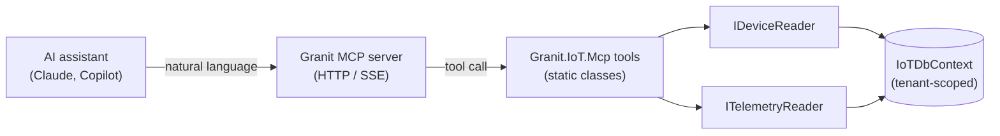
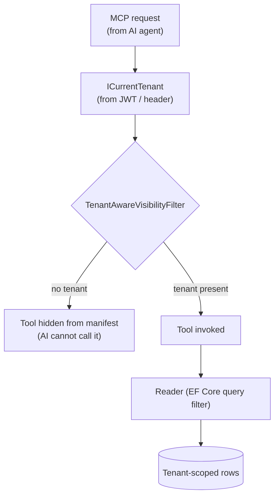

# MCP Bridge — Talk to Your IoT Fleet in Natural Language

Granit.IoT.Mcp turns the IoT device fleet and telemetry history into
conversational APIs for AI assistants. Claude, Copilot, or any MCP-aware client
connected to your Granit MCP server can answer questions like *"which devices
are offline?"* or *"what was the temperature of cold chain #4 over the last two
hours?"* — grounded in the same tenant-scoped data your application already
serves. No business logic leaks into the AI layer, no second source of truth to
keep in sync.

## The problem this package solves

IoT operations teams spend their day in dashboards: filter by status, drill into
a device, pull up a chart. The workflows are simple but the clicks are
repetitive, and every dashboard has its own quirks. Meanwhile an on-call
engineer phoning support at 2am wants to know *"has CC-042 been offline before
tonight?"* without waiting for someone to open the right UI.

[Model Context Protocol](https://modelcontextprotocol.io/) fixes this by
letting AI assistants call structured, authenticated tools. But without a bridge
between MCP and Granit.IoT, those tools do not exist — the AI has no way to
query the fleet. Writing the bridge by hand for each project means hundreds of
lines of boilerplate, and every team gets it slightly wrong on tenant isolation
or response shape.

`Granit.IoT.Mcp` is the bridge: four read-only tools, zero business logic, two
layers of tenant safety.

## The four tools



| Tool | Backing reader | Returns |
| --- | --- | --- |
| `iot_list_devices(statusFilter?, page, pageSize)` | `IDeviceReader.ListAsync` | Paginated `DeviceMcpResponse[]` |
| `iot_get_device(deviceId)` | `IDeviceReader.FindAsync` | `DeviceMcpResponse?` (null if not found) |
| `iot_query_telemetry(deviceId, metricName, from, to, maxPoints)` | `ITelemetryReader.QueryAsync` | `TelemetryReadingMcpResponse[]` filtered by metric |
| `iot_get_latest_readings(deviceId)` | `ITelemetryReader.GetLatestAsync` | One `TelemetryReadingMcpResponse` per metric in the latest point |

Each tool is a `[McpServerTool]` static method with the reader injected as its
first parameter. The MCP SDK resolves the reader from DI and passes it in —
there is no constructor injection, no tool-class lifetime to worry about.

## Tenant isolation — two layers



1. **Layer 1 — Tool visibility.** `[McpTenantScope(RequireTenant = true)]` on
   `DeviceMcpTools` and `TelemetryMcpTools` tells the framework's
   `TenantAwareVisibilityFilter` to hide them from the MCP tool manifest when
   `ICurrentTenant.IsAvailable` is `false`. An anonymous or service-account AI
   session simply does not see these tools.
2. **Layer 2 — Query filters.** `IDeviceReader` and `ITelemetryReader` use EF
   Core named query filters driven by `ICurrentTenant`. Even if a tool executed
   in a cross-tenant context, the SQL would still filter by `TenantId`.

Belt and braces. Cross-tenant data surfacing through MCP is not a possible
failure mode.

## Context window discipline

AI context costs tokens. A naive "give me all telemetry" query can balloon to
tens of thousands of rows and blow the context budget.

`iot_query_telemetry` enforces:

- Default `maxPoints = 100`
- Silent cap at `maxPoints = 1000` even if the AI requests more
- Explicit `from` / `to` time window required — no "all history" shortcut

The cap is declared in the `[Description]` attribute so an AI model that reads
the tool schema knows to paginate or aggregate instead of asking for more.

## Setup

Bundled in `Granit.Bundle.IoT`:

```csharp
builder.Services.AddGranit(builder.Configuration).AddIoT();
```

Or standalone:

```csharp
builder.Services
    .AddGranit(builder.Configuration)
    .AddModule<GranitIoTModule>()
    .AddModule<GranitIoTEntityFrameworkCoreModule>()
    .AddModule<GranitIoTMcpModule>();
```

Then in the HTTP pipeline, expose the MCP server endpoints (from
`Granit.Mcp.Server`):

```csharp
app.MapGranitMcpServer();
```

The IoT tools are auto-discovered by `GranitMcpModule` via assembly scanning on
startup. No manual `WithTools<T>()` call is needed.

## Example conversations

> **User**: *"Summarize the state of my cold-chain sensors for the last hour."*
>
> **Claude**: *(calls `iot_list_devices(statusFilter = "Active")`, then
> `iot_get_latest_readings` on each)*
> You have **28 active cold-chain sensors**. All but two are within their
> configured temperature band. `CC-042` is at 6.1 °C (target: ≤ 4 °C) as of
> 3 minutes ago, and `CC-119` stopped reporting 47 minutes ago — likely a
> battery or network issue.

> **User**: *"What was the temperature of CC-042 between 14:00 and 15:00?"*
>
> **Claude**: *(calls `iot_query_telemetry(deviceId, "temperature",
> "2026-04-17T14:00:00Z", "2026-04-17T15:00:00Z")`)*
> Between 14:00 and 15:00, CC-042 reported 12 readings. Temperature climbed
> from 3.9 °C at 14:00 to 6.1 °C at 14:58 — a steady rise consistent with a
> door being left open or a compressor failure.

## Why not write tools for each domain?

Granit.IoT.Mcp is deliberately the **only** MCP bridge for IoT in this repo.
Other Granit modules (Timeline, Workflow, Notifications) will each ship their
own `Granit.*.Mcp` package so AI assistants see a coherent, modular tool
catalog. Keeping tools grouped by bounded context means:

- Each tool class only needs to know one domain's reader API
- Tenant-scope annotations stay co-located with the data they expose
- Packages can ship independently — a team not using Granit.IoT skips this
  package without losing Timeline or Workflow MCP tools

## Anti-patterns to avoid

> [!WARNING]
> **Never add write tools here.** Provisioning, suspending, or decommissioning
> devices must never flow through an AI prompt. Writes belong behind explicit
> HTTP endpoints with permissions, validation, and audit trail. The
> architecture tests enforce read-only projections.

> [!WARNING]
> **Never surface `TenantId` in a response DTO.** Architecture test
> `McpConventionTests.Response_records_must_not_expose_TenantId` fails the
> build if a property named `*TenantId` appears on any record in
> `Granit.IoT.Mcp.Responses`. Tenant identifiers are infrastructure, not
> conversation content.

> [!WARNING]
> **Never bypass the `maxPoints` cap.** If a legitimate use case needs more
> than 1000 points, it is not an MCP use case — build a background export
> pipeline instead. Letting an AI assistant pull 50 000 rows into a single
> response is a cost incident waiting to happen.

## See also

- [Device management](device-management.md) — the `IDeviceReader` interface used by tools
- [Telemetry ingestion](telemetry-ingestion.md) — where telemetry comes from
- [Architecture](architecture.md) — ring structure (this bridge is Ring 3)
- [`Granit.Mcp.Server`](https://github.com/granit-fx/granit-dotnet) — the MCP HTTP host
- [Model Context Protocol](https://modelcontextprotocol.io/) — the open standard
