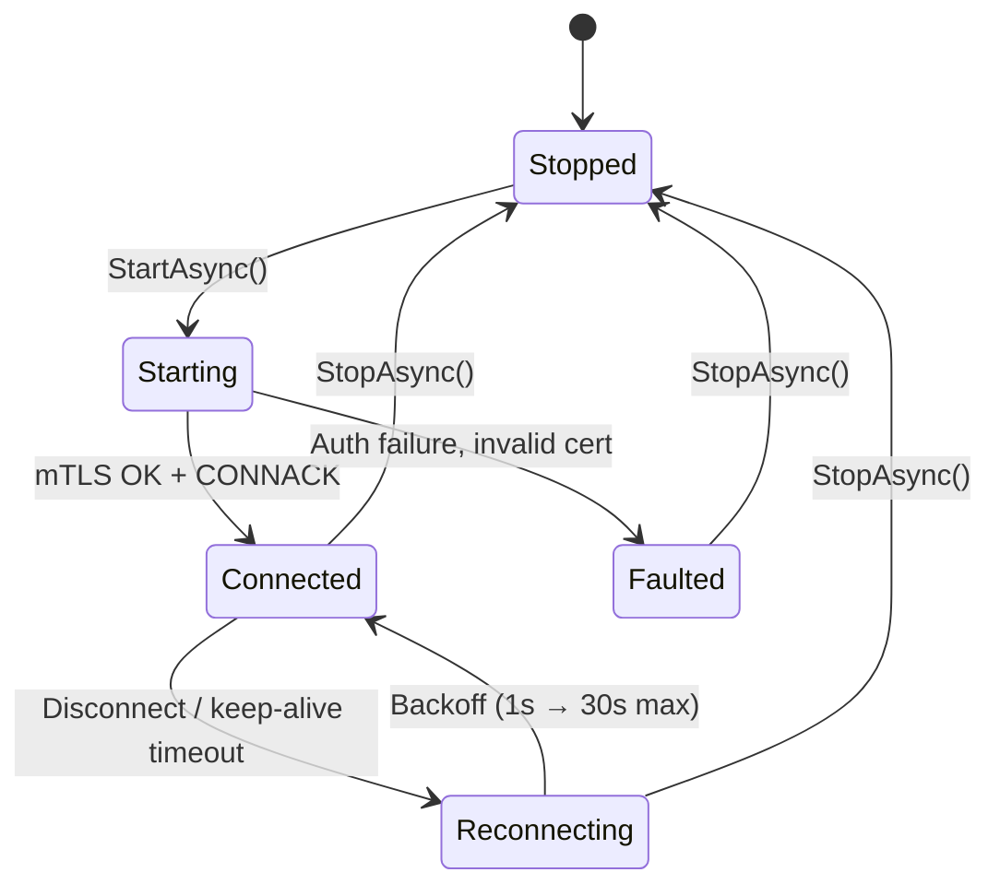
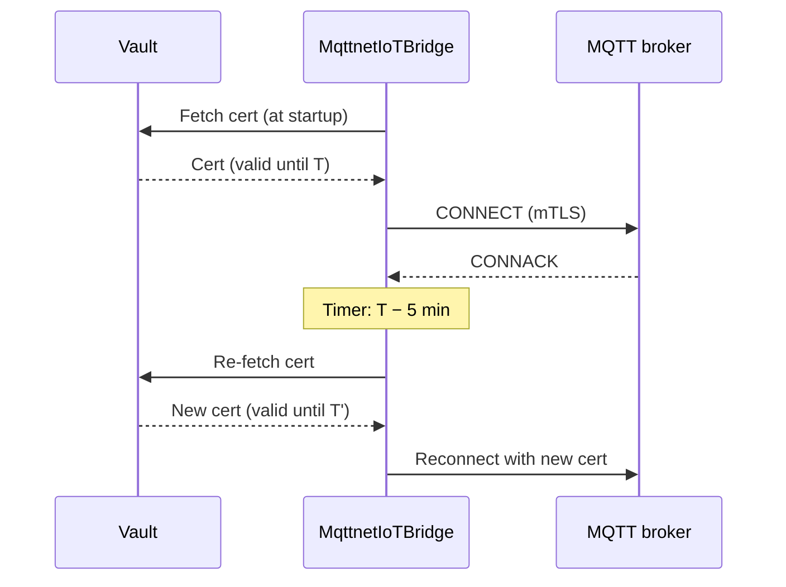

# MQTT Broker Integration in .NET — Granit.IoT.Mqtt

Connect a .NET 10 SaaS application to any MQTT 3.1.1 or 5.0 broker —
Mosquitto, EMQX, HiveMQ, Scaleway IoT Hub in MQTT mode, AWS IoT Core via
forwarding, or a self-hosted broker. Handles mTLS certificates with Vault,
automatic reconnection with exponential backoff, QoS 0–2, and wires the
same telemetry pipeline used by the Scaleway webhook.

## When to use MQTT instead of webhooks

Use the MQTT bridge when you need one of:

- **Push semantics without inbound ports.** Your app consumes from the
  broker; the broker handles device fan-in, auth, and retention.
- **A provider that only speaks MQTT.** AWS IoT Core, Azure IoT Hub, or
  a self-hosted Mosquitto can all feed Granit.IoT via this bridge while
  native providers are still on the roadmap.
- **Lower latency than webhook retries.** The broker holds messages when
  your app is down; reconnection replays them.
- **Devices publishing at MQTT QoS 2 (exactly-once).** The webhook path
  relies on transport-level dedup; MQTT QoS 2 gives you broker-level
  guarantees.

Use the webhook path ([telemetry ingestion](telemetry-ingestion.md)) when
the provider natively pushes HTTP (Scaleway IoT Hub Routes, AWS SNS).

## Packages

| Package | Purpose |
| --- | --- |
| [`Granit.IoT.Mqtt`](../src/Granit.IoT.Mqtt/README.md) | Abstractions — `IIoTMqttBridge`, status enum, message parser, signature validator |
| [`Granit.IoT.Mqtt.Mqttnet`](../src/Granit.IoT.Mqtt.Mqttnet/README.md) | Implementation on top of [MQTTnet](https://github.com/dotnet/MQTTnet) — broker connection, mTLS, backoff, hosted service |

Both packages are **opt-in** — they are not included in `Granit.Bundle.IoT`.
Add them explicitly when you need MQTT:

```bash
dotnet add package Granit.IoT.Mqtt.Mqttnet
```

## Registration

```csharp
using Granit.IoT.Mqtt.Extensions;
using Granit.IoT.Mqtt.Mqttnet.Extensions;

builder.Services
    .AddGranit(builder.Configuration)
    .AddIoT();

builder.Services.AddGranitIoTMqtt();          // abstractions + parser
builder.Services.AddGranitIoTMqttMqttnet();   // MQTTnet implementation
```

`GranitIoTMqttMqttnetModule` registers a hosted service — the broker
connection starts automatically when the app boots and stops on shutdown.

## Configuration — `IoT:Mqtt`

```json
{
  "IoT": {
    "Mqtt": {
      "BrokerUri": "mqtts://mqtt.example.com:8883",
      "ClientId": "granit-iot",
      "DefaultQoS": 1,
      "MaxPayloadBytes": 262144,
      "KeepAliveSeconds": 60,
      "FeatureFlagCacheSeconds": 30,
      "MaxPendingMessages": 1000,
      "CertificateExpiryWarningMinutes": 5
    }
  }
}
```

| Key | Default | Purpose |
| --- | --- | --- |
| `BrokerUri` | *(required)* | Must use `mqtts://` (TLS). Plain `mqtt://` is rejected — IoT telemetry is never sent in clear. |
| `ClientId` | `granit-iot` | MQTT client identifier sent to the broker |
| `DefaultQoS` | `1` | Default QoS for subscriptions (0 = at-most-once, 1 = at-least-once, 2 = exactly-once) |
| `MaxPayloadBytes` | `262144` (256 KB) | Messages larger than this are dropped and counted on `granit.iot.ingestion.signature_rejected` |
| `KeepAliveSeconds` | `60` | Broker keep-alive interval |
| `FeatureFlagCacheSeconds` | `30` | TTL for the "is MQTT bridge enabled for tenant X" cache |
| `MaxPendingMessages` | `1000` | In-flight message buffer — backpressure above this |
| `CertificateExpiryWarningMinutes` | `5` | How early to re-fetch a rotating mTLS cert from Vault |

> [!CAUTION]
> Plain-text `mqtt://` is rejected at startup. IoT brokers frequently
> live on the public internet; always terminate TLS at the broker and
> present a client certificate.

## Connection lifecycle



Reconnection uses exponential backoff capped at 30 seconds. The bridge
never gives up on a transient failure — only terminal auth or cert errors
move it to `Faulted`.

## mTLS and Vault integration

The MQTTnet bridge loads its client certificate from
`Granit.Encryption.Vault` — never from disk or configuration. A certificate
rotated in Vault is picked up automatically `CertificateExpiryWarningMinutes`
before its `NotAfter`:



This removes the entire class of "expired TLS cert took down my IoT fleet"
incidents.

## Consuming telemetry — same pipeline as webhooks

The MQTT bridge wires into the **exact same ingestion pipeline** used by
webhook providers. `MqttMessageParser` produces a `ParsedTelemetryBatch`,
the deduplicator runs against Redis, the outbox publishes
`TelemetryIngestedEto`, and `TelemetryIngestedHandler` persists — none of
the downstream code needs to care whether the message arrived over HTTP
or MQTT.

## Observability

| Metric | Meaning |
| --- | --- |
| `granit.iot.telemetry.ingested` (source tag = `mqtt`) | Message processed end-to-end |
| `granit.iot.ingestion.signature_rejected` (source tag = `mqtt`) | Oversize payload, invalid topic, or missing auth |
| `granit.iot.ingestion.duplicate_skipped` (source tag = `mqtt`) | Redis dedup hit (duplicate packet ID) |

MQTT connection state is also exported as an OpenTelemetry gauge — wire
it to Grafana to see `Reconnecting` storms before users notice.

## Anti-patterns to avoid

> [!WARNING]
> **Don't register the MQTT bridge twice.** One `AddGranitIoTMqttMqttnet()`
> per host. Duplicating the hosted service opens two broker sessions with
> the same `ClientId`, which most brokers interpret as "kick the first
> one" — you'll see infinite reconnect loops.

> [!WARNING]
> **Don't bypass the bridge and subscribe MQTTnet directly.** You lose
> the parser, the dedup, and the outbox. The bridge abstraction exists
> precisely so broker swaps don't touch your domain code.

> [!NOTE]
> **Broker compatibility.** Any broker speaking MQTT 3.1.1 or 5.0 works:
> Mosquitto, EMQX, HiveMQ, VerneMQ, Bevywise, Scaleway IoT Hub (MQTT
> mode), self-hosted. AWS IoT Core and Azure IoT Hub work through MQTT
> too — they're just brokers with SigV4 / SAS auth on the CONNECT packet.

## See also

- [Telemetry ingestion](telemetry-ingestion.md) — the shared pipeline the bridge feeds
- [Device management](device-management.md) — the `Device` model that gets `LastHeartbeatAt` updated
- [Operational hardening](operational-hardening.md) — heartbeat timeout detection
- [Granit.Encryption](https://github.com/granit-fx/granit-dotnet) — Vault client for mTLS certs
