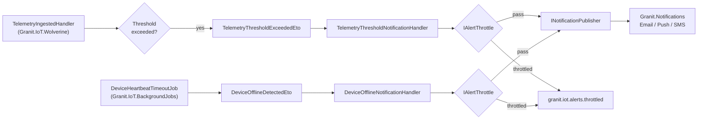

# IoT Notifications Bridge — Threshold Alerts & Offline Alerts for .NET

Route IoT threshold breaches and device-offline events through your
existing multi-channel notification pipeline in Granit — no new
infrastructure, no second notification schema. This guide covers
`Granit.IoT.Notifications`: a thin bridge from IoT integration events
(`TelemetryThresholdExceededEto`, `DeviceOfflineDetectedEto`) to
`Granit.Notifications` notification types, with per-tenant configuration
and built-in alert throttling.

## The problem this package solves

IoT alerts repeatedly end up in a silo:

- **A dedicated IoT inbox.** The operations team watches one UI for
  device alerts, another for billing, another for support tickets. Critical
  alerts get lost in the split.
- **Duplicate notification infrastructure.** Teams ship an "IoT alert email
  service" next to the app's existing notification pipeline, doubling the
  SMTP integration and the bounce handling.
- **Alert storms on flaky hardware.** A sensor dancing around its threshold
  publishes an alert every 10 seconds. The notification channel throttles
  itself (or the customer throttles the app).
- **No per-tenant personalization.** "My warehouse is hot, ship alerts by
  SMS" is impossible without a tenant-override mechanism.

`Granit.IoT.Notifications` bridges the gap by mapping IoT ETOs to
`INotificationPublisher` invocations, honoring per-tenant settings, and
throttling via `IAlertThrottle` — the same primitives every other Granit
module uses.

## How it fits in the pipeline



The IoT module publishes ETOs; the bridge handlers translate them into the
notification model the rest of the app already understands.

## The two notification types

| Class | Severity | Default channels | Triggered by |
| --- | --- | --- | --- |
| `IoTTelemetryThresholdAlertNotificationType` | `Warning` | Email, Push | `TelemetryThresholdExceededEto` |
| `IoTDeviceOfflineNotificationType` | `Fatal` | Email, Push, SMS | `DeviceOfflineDetectedEto` |

Both are registered by `GranitIoTNotificationsModule` via
`INotificationDefinitionProvider` — they show up automatically in the
`Granit.Notifications` admin UI, where end users configure channels and
override per recipient.

> [!TIP]
> **Customers choose their own channels.** Each tenant's admin can
> toggle Email/Push/SMS per notification type. The IoT module never
> decides routing — it only raises typed notifications and lets the
> notification module fan out.

## Alert throttling

Every alert publish goes through `IAlertThrottle` (from
`Granit.Notifications`) before reaching `INotificationPublisher`. The
throttle is per `(tenantId, notificationType, deduplicationKey)` with a
configurable window:

| Key | Default | Purpose |
| --- | --- | --- |
| `IoT:NotificationThrottleMinutes` | `15` | Minutes between repeat alerts for the same `(device, metric)` pair |

Second breach of the same metric within the window increments the
`granit.iot.alerts.throttled` counter instead of paging the on-call.

## Per-tenant configuration via `IoTSettingNames`

All IoT settings are registered by `IoTSettingDefinitionProvider` with
providers `["T", "G"]` (Tenant + Global cascade) — a tenant admin can
override any key without code changes.

| Key | Default | Cascade | Purpose |
| --- | --- | --- | --- |
| `IoT:TelemetryRetentionDays` | `365` | T → G | Retention window enforced by `StaleTelemetryPurgeJob` |
| `IoT:HeartbeatTimeoutMinutes` | `15` | T → G | Offline detection threshold |
| `IoT:HeartbeatOfflineNotificationCacheMinutes` | `60` | T → G | TTL of the offline tracker, preventing alert spam |
| `IoT:NotificationThrottleMinutes` | `15` | T → G | Same-alert throttle window |
| `IoT:IngestRateLimit` | *(set in rate-limit policy)* | T → G | Per-tenant ingest rate (used by `Granit.RateLimiting`) |
| `IoT:Threshold:{metricName}` | *(unset)* | T → G | Per-metric threshold (e.g., `IoT:Threshold:temperature = 28.5`) |

All keys are read through `ISettingProvider.GetOrNullAsync()` — look up
cost is `~µs` after FusionCache warmup.

## Registration

The bridge is included in `Granit.Bundle.IoT`:

```csharp
builder.Services.AddGranit(builder.Configuration).AddIoT();
```

Or standalone:

```csharp
builder.Services.AddGranitIoTNotifications();
```

`GranitIoTNotificationsModule` depends on `GranitIoTModule` and
`GranitNotificationsModule`. No further setup is required — the
Wolverine handlers are discovered automatically.

## Wiring your own alert sources

Need to raise a custom alert that isn't a threshold breach or offline
event? Publish your own `IIntegrationEvent` via
`IDistributedEventBus.PublishAsync()` and register a handler that maps it
to `INotificationPublisher.PublishAsync(YourNotificationType.From(eto))`.
The IoT bridges are the reference pattern — 15 lines of code apiece.

> [!NOTE]
> **Don't raise notifications from the ingestion endpoint.** The
> endpoint's job is to return 202 fast. Publish an ETO, let a Wolverine
> handler decide whether it becomes a notification. That's what retries,
> outbox, and throttling are for.

## Observability

| Metric | Tags | Fires when |
| --- | --- | --- |
| `granit.iot.ingestion.threshold_exceeded` | `tenant_id`, `metric_name` | Threshold evaluator flagged a breach |
| `granit.iot.alerts.throttled` | `tenant_id`, `metric_name` | Throttle suppressed a duplicate alert |
| `granit.iot.device.offline_detected` | `tenant_id` | Heartbeat job flagged first offline detection |

`Granit.Notifications` adds its own metrics on channel-level delivery
(`granit.notifications.sent`, `granit.notifications.failed`) — wire both
for a complete picture of "alert fired → customer notified."

## Anti-patterns to avoid

> [!WARNING]
> **Don't call `INotificationPublisher` directly from the ingestion
> handler.** You skip the throttle, skip the tenant cascade, and tie
> business alerting to transport code. Always publish an ETO and let the
> bridge handle it.

> [!WARNING]
> **Don't lower `IoT:NotificationThrottleMinutes` below 1.** Most SMS
> providers throttle at 1 msg/sec/recipient; exceeding that gets your
> sender flagged as spam.

## See also

- [Telemetry ingestion](telemetry-ingestion.md) — where `TelemetryThresholdExceededEto` is raised
- [Operational hardening](operational-hardening.md) — where `DeviceOfflineDetectedEto` is raised
- [Timeline bridge](timeline-bridge.md) — the other cross-cutting Ring 3 package
- [`Granit.Notifications`](https://github.com/granit-fx/granit-dotnet) — framework notification infrastructure
