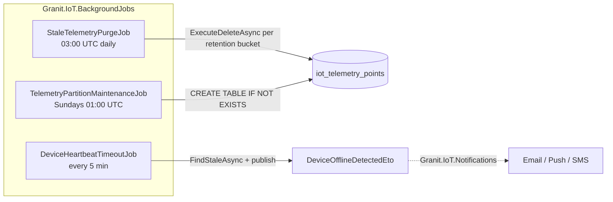
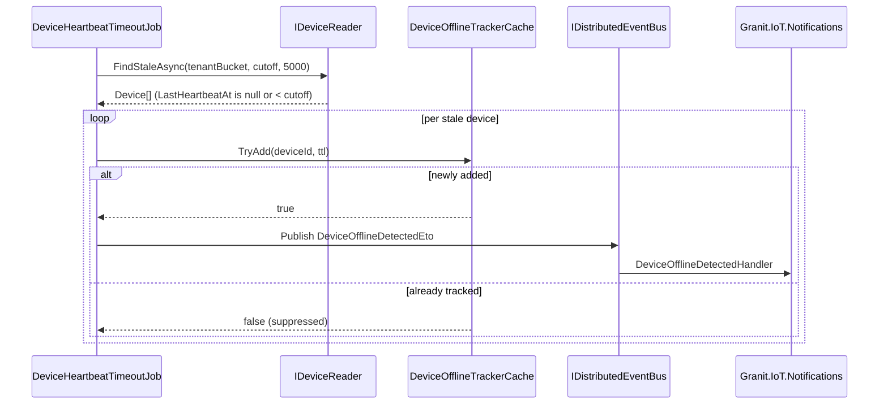

# IoT Operational Hardening — Purge, Heartbeat & Partition Maintenance

Keep a multi-tenant IoT telemetry database healthy at scale: automated
retention enforcement, offline-device detection, and PostgreSQL partition
maintenance. This guide covers `Granit.IoT.BackgroundJobs` — three recurring
jobs that run on top of `Granit.BackgroundJobs` and keep your system
predictable from day 1 to year 5.

## The problems this package solves

Telemetry tables grow without supervision. Three failure modes recur in
every IoT deployment:

- **Unbounded storage.** At 100,000 devices × 6 publishes / minute, you
  add ~260 million rows per month. A year in, your cheapest query is
  slow and your backups are unworkable.
- **Silent device failures.** A sensor stops publishing. Nobody notices
  until the dashboard goes flat. Without automated heartbeat detection,
  "is my fleet online?" is a human question.
- **Partition bookkeeping.** Monthly partitioning works — until the day
  a write arrives for next month and PostgreSQL errors out because the
  partition was never created.

`Granit.IoT.BackgroundJobs` closes all three with scheduled jobs that
know how Granit.IoT lays out its data and settings.

## The three jobs



All three jobs are implemented as `IBackgroundJob` records with
`[RecurringJob]` attributes and single-leader scheduling — Wolverine makes
sure they run on exactly one node even in a horizontally scaled deployment.

## StaleTelemetryPurgeJob — GDPR retention enforcement

**Schedule**: `0 3 * * *` (daily, 03:00 UTC).
**Purpose**: delete telemetry older than the per-tenant retention window.

### How it scales — bucketed deletes, not N+1

Naively looping `DELETE WHERE tenant_id = @t AND recorded_at < @cutoff`
per tenant scales linearly — painful past 1,000 tenants. The purge job
does something smarter:

1. Scan distinct `TenantId` values from `iot_devices` (cheap — tens of
   thousands of devices, not hundreds of millions of telemetry rows).
2. Resolve each tenant's effective `IoT:TelemetryRetentionDays` via
   `Granit.Settings` (FusionCache-backed, microsecond lookups after warmup).
3. **Group tenants by their effective retention value** — in production,
   ~80% of tenants use the default, so 10,000 tenants typically collapse
   to 2–4 buckets.
4. Issue **one `ExecuteDeleteAsync` per bucket** with
   `WHERE tenant_id = ANY(@array) AND recorded_at < @cutoff`.

| Scenario | Raw tenant count | SQL DELETEs issued |
| --- | --- | --- |
| All tenants on default 365 days | 10,000 | **1** |
| 90% default, 10% custom (30 or 730 days) | 10,000 | **3** |
| Every tenant different | 10,000 | 10,000 (worst case) |

A **30-minute hard deadline** wraps the job on a 24 h cycle — a runaway
delete never overlaps the next run.

### Configuration

| Key | Default | Purpose |
| --- | --- | --- |
| `IoT:TelemetryRetentionDays` | `365` | Days of telemetry kept per tenant. Set `0` on a tenant to disable purge for that tenant (not recommended in production). |

> [!NOTE]
> **Partitioning wins vs `ExecuteDeleteAsync`.** At month boundaries,
> when every tenant's retention has rolled past the oldest partition,
> dropping that partition is O(1) and instantaneous. The current job
> uses `ExecuteDeleteAsync` for correctness across mixed retention
> values; the partition-drop optimization is tracked as a follow-up.

## DeviceHeartbeatTimeoutJob — offline device detection

**Schedule**: `*/5 * * * *` (every 5 minutes).
**Purpose**: flag devices whose last heartbeat is older than the tenant's
timeout, publish `DeviceOfflineDetectedEto`, and **suppress re-alerts**
on flaky links via an in-memory tracker cache.

### Flow



### Why the tracker cache matters

A device on a flaky cellular link can drop out and reconnect multiple
times per hour. Publishing an alert on every 5-minute cycle is spam.
`DeviceOfflineTrackerCache` uses `IMemoryCache` keyed by device ID with
TTL = `IoT:HeartbeatOfflineNotificationCacheMinutes` (default 60 min).
First offline detection publishes; subsequent detections within the TTL
silently skip. When telemetry resumes, the `TelemetryIngestedHandler`
calls `Forget(deviceId)` so future disappearances are re-eligible.

### Bucketed per-tenant timeout

Same bucketing pattern as the purge job: tenants are grouped by their
effective `IoT:HeartbeatTimeoutMinutes`, and `FindStaleAsync` is called
once per bucket with `tenant_id = ANY(@array)`.

A **4-minute hard deadline** on a 5-minute cron prevents overlapping runs
even under unusual load.

### Configuration

| Key | Default | Purpose |
| --- | --- | --- |
| `IoT:HeartbeatTimeoutMinutes` | `15` | Minutes since last heartbeat before flagging offline. Set `0` per tenant to disable. |
| `IoT:HeartbeatOfflineNotificationCacheMinutes` | `60` | Tracker TTL preventing alert spam on flaky links. |

## TelemetryPartitionMaintenanceJob — ahead-of-time partition creation

**Schedule**: `0 1 * * 0` (Sundays, 01:00 UTC).
**Purpose**: provision next-month and next-next-month partitions so writes
never fail on a boundary transition.

The job is a **graceful no-op** when the parent table is not partitioned
— it checks `pg_partitioned_table` and logs a single warning. This lets
non-partitioned deployments keep the job registered without side effects.

### Enabling partitioning

Partitioning is opt-in because converting an already-populated table
requires a data-copy migration. Enable it in your application's IoT
migration **before the first large-scale insert**:

```csharp
protected override void Up(MigrationBuilder migrationBuilder)
{
    migrationBuilder.EnableTelemetryPartitioning();
    migrationBuilder.CreateTelemetryPartition(2026, 4);
    migrationBuilder.CreateTelemetryPartition(2026, 5);
    // Subsequent months are provisioned automatically by the job
}
```

Every partition carries its own BRIN(`recorded_at`) and GIN(`metrics`)
indexes — dropping the partition drops the indexes with it, which is why
GDPR erasure at a month boundary is O(1).

### Configuration

None. The job infers the schema and table name from `IoTDbContext`.

## Registering the jobs

The jobs are bundled in `Granit.Bundle.IoT`:

```csharp
builder.Services.AddGranit(builder.Configuration).AddIoT();
```

Or register individually (e.g. when not using the bundle):

```csharp
builder.Services.AddGranitIoTBackgroundJobs();
```

`GranitIoTBackgroundJobsModule` depends on `GranitIoTModule`,
`GranitBackgroundJobsModule`, and `GranitSettingsModule` — DI resolution
order is driven by `[DependsOn]`, not by the order of these calls.

## Observability

| Metric | Tags | Fires when |
| --- | --- | --- |
| `granit.iot.background.telemetry_purged` | `tenant_id` | Purge job deleted rows for a tenant |
| `granit.iot.device.offline_detected` | `tenant_id` | Heartbeat job flagged a device (first detection only; tracker suppresses re-fires) |
| `granit.iot.background.partition_created` | `partition_name` | Future partition created |
| `granit.iot.alerts.throttled` | `tenant_id`, `metric_name` | Notification bridge suppressed an alert |

Wolverine also emits job-level telemetry (`wolverine.job.execution_duration`,
`wolverine.job.failures`) — wire both to Grafana for a single pane of glass.

## Anti-patterns to avoid

> [!WARNING]
> **Don't call `EnableTelemetryPartitioning()` on a populated table.**
> It converts the table to partitioned, which means existing rows move
> into `DEFAULT` — and you've lost time-bounded drop semantics. Do this
> on an empty table at the start of your project, or write a dedicated
> data-copy migration.

> [!WARNING]
> **Don't shorten the purge cron to hourly.** The default 24 h window
> is deliberate — you want large, infrequent deletes that don't compete
> with ingestion traffic for database locks.

> [!WARNING]
> **Don't bypass the tracker cache by publishing `DeviceOfflineDetectedEto`
> from your own code.** The tracker exists to prevent alert spam — publish
> your own alerts through `Granit.Notifications` directly if you need
> custom signals.

## See also

- [Device management](device-management.md) — the `Device` aggregate's `RecordHeartbeat` and `LastHeartbeatAt`
- [Telemetry ingestion](telemetry-ingestion.md) — the pipeline that feeds the heartbeat
- [Notifications bridge](notifications-bridge.md) — where `DeviceOfflineDetectedEto` becomes an alert
- [Timeline bridge](timeline-bridge.md) — device state changes as audit chatter
- [`Granit.BackgroundJobs`](https://github.com/granit-fx/granit-dotnet) — the job runtime
