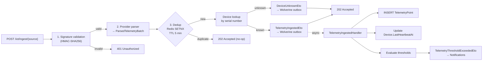
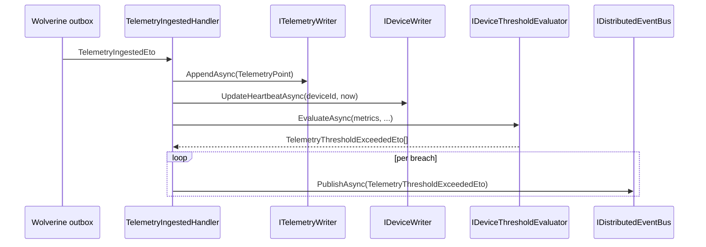

# IoT Telemetry Ingestion Pipeline — HMAC, Deduplication, Outbox

High-throughput telemetry ingestion for .NET 10 SaaS applications: HMAC-SHA256
webhook signature validation, Redis deduplication, Wolverine outbox dispatch,
and threshold evaluation — all provider-agnostic. This guide covers Ring 2 of
Granit.IoT: `Granit.IoT.Ingestion`, `Granit.IoT.Ingestion.Endpoints`,
`Granit.IoT.Ingestion.Scaleway`, and `Granit.IoT.Wolverine`.

## The problems Ring 2 solves

Teams wiring their first IoT provider hit the same five problems every time:

- **Blocking webhooks.** Inline persistence and threshold evaluation slow
  the HTTP response and trip provider retry timers. The provider retries,
  you persist twice.
- **Forgotten signature validation.** A webhook endpoint without HMAC
  validation is a public insert into your database.
- **Duplicate messages.** MQTT redelivery, provider retries, and network
  flaps push the same payload to your endpoint multiple times. Without
  deduplication, alerts fire twice.
- **Provider lock-in.** Scaleway ships one envelope, AWS another, Azure a
  third. Handling each in your domain code makes the code rot.
- **Silent thresholds.** Alert rules live in spreadsheets, or in handler
  `if`-chains that can't be overridden per tenant.

Ring 2 fixes all of these with a three-stage pipeline that validates,
normalizes, and dispatches — returning `202 Accepted` in under a second, at
P99, at 100k devices emitting every 10 seconds.

## Pipeline overview



Stage 1 and 2 are synchronous — they must succeed before returning `202`.
Stage 3 and everything downstream are asynchronous via Wolverine's
transactional outbox, so a slow database never blocks the HTTP response.

## Pipeline abstractions

Each provider plugs into three extension points:

```csharp
public interface IPayloadSignatureValidator
{
    string SourceName { get; }  // e.g. "scaleway"
    ValueTask<SignatureValidationResult> ValidateAsync(
        ReadOnlyMemory<byte> body,
        IReadOnlyDictionary<string, string> headers,
        CancellationToken ct = default);
}

public interface IInboundMessageParser
{
    string SourceName { get; }  // matches validator's SourceName
    ValueTask<ParsedTelemetryBatch> ParseAsync(
        ReadOnlyMemory<byte> body,
        CancellationToken ct = default);
}

public interface IInboundMessageDeduplicator
{
    /// <summary>Returns true if this is the first time the message ID is seen.</summary>
    Task<bool> TryAcquireAsync(string sanitizedMessageId, CancellationToken ct = default);
}
```

The orchestrator `IIngestionPipeline.ProcessAsync(source, body, headers, ct)`
looks up the validator and parser by `SourceName` (case-insensitive), runs the
three stages, and publishes the right ETO. Adding AWS IoT Core is literally
two new classes.

### Normalized shape — `ParsedTelemetryBatch`

Whatever the provider ships, the parser produces:

```csharp
public sealed record ParsedTelemetryBatch(
    string MessageId,
    string DeviceExternalId,
    DateTimeOffset RecordedAt,
    IReadOnlyDictionary<string, double> Metrics,
    string Source,
    IReadOnlyDictionary<string, string>? Tags);
```

Downstream handlers only ever see this shape — they don't care that it came
from Scaleway's Base64 envelope or AWS SNS.

## Scaleway IoT Hub

`Granit.IoT.Ingestion.Scaleway` is the production-ready provider for
[Scaleway IoT Hub](https://www.scaleway.com/en/iot-hub/). It ships three
internal services registered by `AddGranitIoTIngestionScaleway()`:

| Service | Responsibility |
| --- | --- |
| `ScalewaySignatureValidator` | Validates `X-Scaleway-Signature` (HMAC-SHA256) via `CryptographicOperations.FixedTimeEquals` (timing-oracle-safe) |
| `ScalewayMessageParser` | Decodes the JSON envelope, Base64-decodes the payload, extracts metrics |
| `ScalewayTopicMapper` | Extracts the device serial from the MQTT topic (`devices/{serial}/...` by default) |

### Scaleway envelope shape

```json
{
  "topic": "devices/ACME-TH-001/telemetry",
  "message_id": "550e8400-e29b-41d4-a716-446655440000",
  "payload": "eyJ0ZW1wIjoyMi41LCJodW1pZGl0eSI6NDUuMH0=",
  "qos": 1,
  "timestamp": "2026-04-17T12:34:56Z"
}
```

The `payload` decodes to `{"temp": 22.5, "humidity": 45.0}`, which becomes
the `Metrics` dictionary in `ParsedTelemetryBatch`.

### Configuration

```json
{
  "IoT": {
    "Ingestion": {
      "Scaleway": {
        "SharedSecret": "__FROM_SECRET_STORE__",
        "TopicDeviceSegmentIndex": 1
      }
    }
  }
}
```

| Key | Purpose |
| --- | --- |
| `SharedSecret` | Shared secret configured in the Scaleway IoT Hub console, used for HMAC-SHA256 validation |
| `TopicDeviceSegmentIndex` | Zero-based index of the topic segment holding the device serial. Default `1` matches `devices/{serial}/...` |

Options bind via `IOptionsMonitor<ScalewayIoTOptions>` — rotating the shared
secret is a configuration reload, no restart required.

## AWS IoT Core

AWS IoT Core support is split across two packages:

- [`Granit.IoT.Ingestion.Aws`](../src/Granit.IoT.Ingestion.Aws/README.md) —
  SNS subscription, direct HTTP, and API Gateway variants. **First slice
  shipping**: the SNS path (RSA-SHA256 + CDN-guarded cert cache + replay
  dedup + topic-ARN allow-list). SigV4 (Direct, API Gateway) and the message
  parsers land in follow-up commits.
- [`Granit.IoT.Aws`](https://github.com/granit-fx/granit-iot/issues/36) —
  device provisioning, device shadows, fleet jobs (planned, not started).

Until the SigV4 paths and parsers land, AWS IoT Core SNS deliveries can be
verified end-to-end via the SNS validator but the parser stage is still a
follow-up. AWS-native teams that want full ingestion today can forward IoT
Core messages through a generic MQTT bridge — see [MQTT](mqtt.md). The
domain model, persistence, and notification bridges are provider-agnostic;
only the ingestion edge changes.

## The ingestion endpoint — `POST /iot/ingest/{source}`

Mapped by `MapGranitIoTIngestionEndpoints()` in
`Granit.IoT.Ingestion.Endpoints`:

| Status | Meaning |
| --- | --- |
| `202 Accepted` | Signature valid, payload parsed, dispatched to outbox (or duplicate silently accepted) |
| `400 Bad Request` | Malformed payload (Base64 fail, missing field, invalid JSON) |
| `401 Unauthorized` | Signature validation failed |
| `415 Unsupported Media Type` | Non-JSON content type |
| `422 Unprocessable Entity` | No parser registered for the `{source}` path parameter |

The endpoint buffers the request body up to **256 KB** (enough for even the
chattiest MQTT payload), snapshots headers into a case-insensitive dictionary,
and delegates to `IIngestionPipeline.ProcessAsync()`.

Rate limiting is enforced at the route group level via `Granit.RateLimiting`
(`iot-ingest` policy by default) — configure per-tenant limits under
`RateLimiting:Policies:iot-ingest` in `appsettings.json`.

## Deduplication — transport-level, Redis-backed, fail-open

`IdempotencyStoreInboundMessageDeduplicator` backs onto Redis via
`IIdempotencyStore` (from `Granit.Http.Idempotency`). The key is the
**sanitized transport message ID** (trimmed, capped at 128 chars,
non-alphanumeric replaced with `-`), prefixed `iot-msg:`.

| Parameter | Default | Key |
| --- | --- | --- |
| TTL | 5 minutes | `IoT:Ingestion:DeduplicationWindowMinutes` |

**Fail-open behavior.** If Redis is unreachable, the deduplicator returns
`true` (process the message). Availability wins over strict idempotency —
dropping a real reading is worse than processing a rare duplicate.

> [!NOTE]
> Transport-level dedup, not business-level. The key is the provider
> message ID (`X-Scaleway-Message-Id`, MQTT packet identifier, SNS message
> ID) — not the device + timestamp. This keeps the pipeline generic and
> lets the provider's own retry semantics drive the dedup window.

## The Wolverine handler

`TelemetryIngestedHandler` consumes `TelemetryIngestedEto` from the outbox:



Everything in the handler runs inside a single Wolverine transaction —
if the threshold publication fails, the telemetry persist rolls back and
the message is retried. No half-written state.

## Threshold evaluation

`IDeviceThresholdEvaluator` is the extension point. The default
implementation `SettingsDeviceThresholdEvaluator` uses `Granit.Settings`
for **cascaded, per-tenant-overridable** thresholds:

```csharp
public interface IDeviceThresholdEvaluator
{
    Task<IReadOnlyList<TelemetryThresholdExceededEto>> EvaluateAsync(
        Guid deviceId, Guid? tenantId,
        IReadOnlyDictionary<string, double> metrics,
        DateTimeOffset recordedAt,
        CancellationToken ct = default);
}
```

Settings key format: `IoT:Threshold:{metricName}` — for example
`IoT:Threshold:temperature = 28.5`. The cascade order is
**User → Tenant → Global → Configuration → Default**, which means a single
operator can raise the threshold on one noisy device without touching the
global baseline.

> [!TIP]
> Need different thresholds by device family (sensor A vs sensor B)?
> Override `IDeviceThresholdEvaluator` with your own implementation —
> it's a single DI registration swap.

## Observability — `IoTMetrics`

All pipeline stages emit OpenTelemetry counters. Scrape them with the
standard Prometheus exporter registered by `Granit.Diagnostics`:

| Counter | Tags | Fires when |
| --- | --- | --- |
| `granit.iot.telemetry.ingested` | `tenant_id`, `source` | TelemetryPoint persisted |
| `granit.iot.ingestion.signature_rejected` | `tenant_id`, `source` | HMAC validation failed |
| `granit.iot.ingestion.duplicate_skipped` | `tenant_id`, `source` | Redis dedup hit |
| `granit.iot.ingestion.unknown_device` | `tenant_id`, `source` | Serial not registered |
| `granit.iot.ingestion.threshold_exceeded` | `tenant_id`, `metric_name` | Threshold breached |
| `granit.iot.alerts.throttled` | `tenant_id`, `metric_name` | Notification suppressed by the bridge |
| `granit.iot.device.offline_detected` | `tenant_id` | Heartbeat job flagged device |
| `granit.iot.background.telemetry_purged` | `tenant_id` | Purge job deleted rows |
| `granit.iot.background.partition_created` | `partition_name` | Partition maintenance job ran |

Alert routing goes through `Granit.Notifications` — see
[Notifications bridge](notifications-bridge.md).

## Anti-patterns to avoid

> [!WARNING]
> **Don't write synchronous DB logic in the endpoint handler.** The
> endpoint's job is: validate, parse, dedup, publish. The persist happens
> in the Wolverine handler so the HTTP response stays fast.

> [!WARNING]
> **Don't skip signature validation "just for testing."** A public
> `/iot/ingest/scaleway` endpoint without HMAC validation is an insert-only
> database backdoor. Use a test-specific validator (`NoopValidator`)
> behind `IsDevelopment()` if you really need it.

> [!WARNING]
> **Don't tune the dedup TTL up to cover "long retries."** Redis memory
> scales with active working set. If your provider's retry window is 30
> minutes, use idempotency keys on the business key, not on the Redis
> transport cache.

## See also

- [Device management](device-management.md) — the domain that receives the telemetry
- [MQTT](mqtt.md) — alternative to webhooks for MQTT-native providers
- [Operational hardening](operational-hardening.md) — purge, heartbeat, partitioning
- [Notifications bridge](notifications-bridge.md) — where threshold alerts land
- [Getting started](getting-started.md) — 5-minute quickstart with Scaleway
