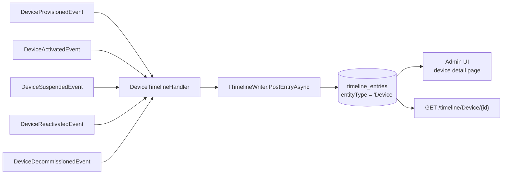

# IoT Timeline Bridge — Device Lifecycle as Audit Chatter

Every provision, activation, suspension, reactivation, and decommissioning
of an IoT device becomes a system-log entry in `Granit.Timeline`, the
Odoo-style activity chatter for any Granit entity. No extra code, no extra
schema — your support team, your compliance auditor, and your mobile app
all see the same audit trail.

## The problem this package solves

ISO 27001 asset traceability and GDPR audit logs both demand **who did
what, when, and why** on every long-lived asset. Without a bridge, IoT
events land in three different places:

- **In the database audit columns.** `CreatedBy` / `ModifiedBy` tell you
  *who last touched the row* — not the full sequence of transitions.
- **In structured logs.** Searchable, yes. But not joined to the device
  record in the admin UI, and rotated away after 30 days.
- **In nowhere at all.** `Suspend("sensor was decommissioned by
  accident")` without a persistent audit entry means the next incident
  reviewer reinvents the history.

`Granit.IoT.Timeline` is a **15-line handler module** that listens to
device domain events and writes them as `TimelineEntryType.SystemLog`
entries. The rest of your app queries them through `ITimelineReader` just
like any other entity's chatter.

## The five bridged events



| Domain event | Timeline body |
| --- | --- |
| `DeviceProvisionedEvent` | `Device provisioned: {SerialNumber} (status = Provisioning)` |
| `DeviceActivatedEvent` | `Device activated: {SerialNumber} (Provisioning → Active)` |
| `DeviceSuspendedEvent` | `Device suspended (Active → Suspended): reason = '{Reason}'` |
| `DeviceReactivatedEvent` | `Device reactivated: {SerialNumber} (Suspended → Active)` |
| `DeviceDecommissionedEvent` | `Device decommissioned (status = Decommissioned)` |

Each entry carries `entityType = "Device"` and `entityId = deviceId`. The
Timeline module resolves the authoring user from `ICurrentUser` automatically,
so the audit trail is attributable to a real principal (not just "system").

## Registration

Bundled in `Granit.Bundle.IoT`:

```csharp
builder.Services.AddGranit(builder.Configuration).AddIoT();
```

Or standalone:

```csharp
builder.Services.AddGranitIoTTimeline();
```

`GranitIoTTimelineModule` depends on `GranitIoTModule` and
`GranitTimelineModule`. The handlers are `internal static partial` —
Wolverine auto-discovers them on startup, so no manual handler
registration is needed.

## Querying the timeline

`Granit.Timeline.Endpoints` exposes `/api/timeline/{entityType}/{entityId}`
by default:

```bash
curl "https://your-app/api/timeline/Device/$DEVICE_ID" \
  -H "Authorization: Bearer $TOKEN"
```

Response includes each system-log entry in chronological order — exactly
what a support engineer needs when "device goes offline" turns into a
support ticket.

## Why this matters for compliance

- **ISO 27001 A.8.1.1** — asset inventory management. Every device has a
  full provenance trail (provisioning, activation, state changes,
  decommissioning).
- **ISO 27001 A.12.4.1** — event logging. Device lifecycle events are
  logged in a tamper-resistant timeline durable past log rotation.
- **GDPR Art. 30** — records of processing activities. Tenant-scoped
  timeline entries let a Data Protection Officer reconstruct who touched
  which device on behalf of which data subject.

Because `Granit.Timeline` entries are tenant-scoped and permission-checked,
a tenant admin can grant auditors read-only access to their own device
chatter without exposing any other tenant's data.

## Extending the bridge

Need to surface custom device events (firmware update, credential
rotation, custom workflow transition) in the same timeline?

1. Raise an `IDomainEvent` from your code
2. Add a handler method in your own `internal static partial` class:

   ```csharp
   public static Task HandleAsync(
       FirmwareUpdatedEvent e,
       ITimelineWriter writer,
       CancellationToken ct) =>
       writer.PostEntryAsync(
           entityType: "Device",
           entityId: e.DeviceId.ToString(),
           entryType: TimelineEntryType.SystemLog,
           body: $"Firmware updated: {e.PreviousVersion} → {e.NewVersion}",
           cancellationToken: ct);
   ```

Wolverine picks it up automatically.

## Anti-patterns to avoid

> [!WARNING]
> **Don't call `ITimelineWriter.PostEntryAsync` from inside the domain
> aggregate.** The aggregate raises events; handlers observe them and
> write side effects. Inverting this breaks the pure-domain rule and makes
> unit tests need a `ITimelineWriter` mock.

> [!WARNING]
> **Don't write sensitive payload data into the timeline body.** The
> body is free-form text. Passwords, tokens, and PII belong in the
> `SensitiveData` columns of their respective entities, not here.

## See also

- [Device management](device-management.md) — the domain events that drive the handlers
- [Notifications bridge](notifications-bridge.md) — the other Ring 3 bridge
- [Operational hardening](operational-hardening.md) — offline detection also creates timeline entries (via Timeline's standard `DeviceOffline*` event)
- [`Granit.Timeline`](https://github.com/granit-fx/granit-dotnet) — the activity-stream framework module
