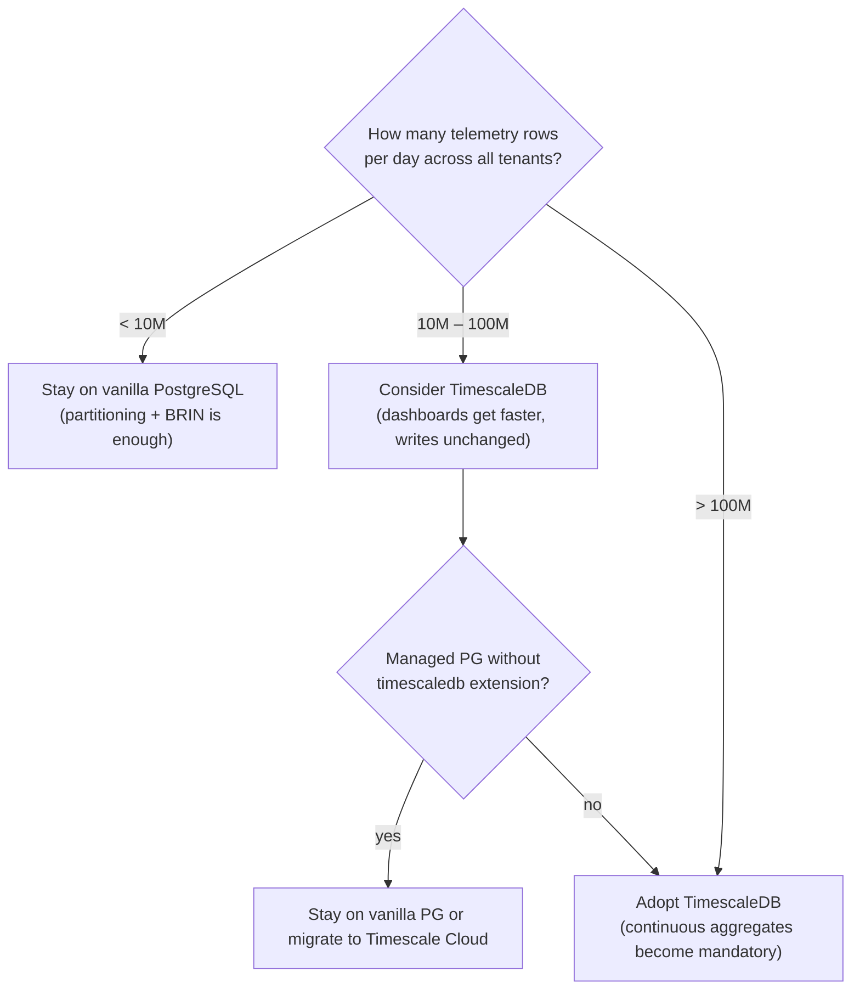
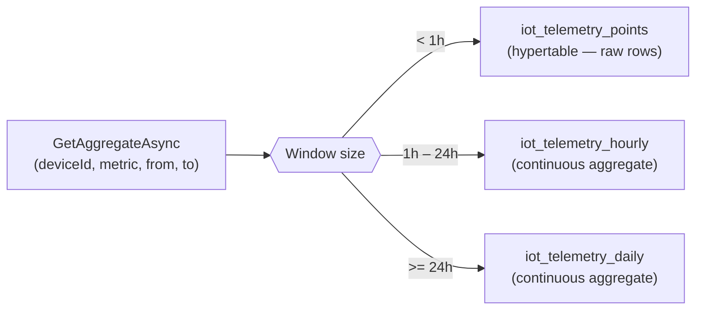

# TimescaleDB Backend — Scaling Telemetry to Billions of Rows

Granit.IoT stores every payload as one row per device send, with metrics in a
JSONB column — the default PostgreSQL backend indexes this with BRIN on
`RecordedAt`, GIN on `Metrics`, and monthly RANGE partitioning. That scales
happily to hundreds of millions of rows. Past that point, dashboard queries
that scan seven days of data start blocking for seconds while the cluster
chews through JSONB extractions. `Granit.IoT.EntityFrameworkCore.Timescale`
is the opt-in answer: convert the table to a TimescaleDB hypertable and
pre-materialize hourly and daily rollups so those dashboard queries finish in
milliseconds.

## When to adopt this package



TimescaleDB is an opinionated choice. It requires the `timescaledb`
PostgreSQL extension, which means:

- **Self-hosted PostgreSQL** → install the extension (`apt install`, Helm
  chart, or TimescaleDB Docker image)
- **Scaleway Managed Database** → not available — fall back to vanilla
- **AWS RDS** → not available — use Timescale Cloud or RDS + self-managed
- **Timescale Cloud** → it's the default, nothing to install

> [!NOTE]
> The package detects the extension at startup. If it is absent, the module
> logs a warning and skips all DDL — the application starts normally, the
> telemetry table stays a plain PostgreSQL table. You can safely deploy this
> module in a multi-environment setup where only some clusters have the
> extension.

## How it speeds up queries



The continuous aggregates store one row per `(hour|day, device, metric)`
tuple with pre-computed avg / min / max / count. Querying them is a simple
indexed lookup — no JSONB extraction, no row scan, no aggregation at query
time.

Typical speed-up on a 100-million-row table:

| Query | Raw hypertable | Continuous aggregate |
| --- | --- | --- |
| `AVG(temperature)` over 24h for one device | ~180 ms | ~3 ms |
| `MAX(temperature)` over 7 days for one device | ~1.5 s | ~4 ms |
| `COUNT(*)` over 30 days for one device | ~4 s | ~6 ms |

(Numbers are indicative — exact performance depends on the chunk interval,
compression policy, and the disk subsystem.)

## Enabling TimescaleDB

The module is opt-in. Add it after the base EF Core module:

```csharp
builder.Services
    .AddGranit(builder.Configuration)
    .AddModule<GranitIoTModule>()
    .AddModule<GranitIoTEntityFrameworkCoreModule>()
    .AddModule<GranitIoTTimescaleModule>();
```

On first startup the module runs:

1. `SELECT 1 FROM pg_extension WHERE extname = 'timescaledb'` — extension
   detection. If not found, log a warning and stop.
2. `SELECT create_hypertable('iot_telemetry_points', 'RecordedAt',
   chunk_time_interval => INTERVAL '7 days', if_not_exists => TRUE,
   migrate_data => TRUE)` — convert the table. Safe on an empty table, safe
   on a populated one (TimescaleDB copies rows into the first chunk).
3. `CREATE MATERIALIZED VIEW iot_telemetry_hourly WITH
   (timescaledb.continuous) AS ...` — expand the JSONB `Metrics` column via
   `LATERAL jsonb_each`, one row per metric per hour bucket.
4. Same for `iot_telemetry_daily`.
5. `add_continuous_aggregate_policy` on both views — refresh the hourly view
   every 30 minutes (lag 1 hour, window 3 hours) and the daily view every 6
   hours (lag 1 day, window 3 days). All wrapped in a
   `WHEN duplicate_object THEN NULL` guard so re-runs are no-ops.

All DDL is idempotent. Deploying the module twice does nothing the second time.

## Migration-driven alternative

If you prefer the DDL in a versioned migration rather than at startup:

```csharp
public partial class AddTimescale : Migration
{
    protected override void Up(MigrationBuilder migrationBuilder)
    {
        migrationBuilder.EnableTelemetryHypertable();
        migrationBuilder.CreateTelemetryHourlyAggregate();
        migrationBuilder.CreateTelemetryDailyAggregate();
    }
}
```

In this mode, skip the module — just register the `TimescaleTelemetryEfCoreReader`
via `services.AddGranitIoTTimescale()`.

## Observability

- The startup log includes `"Granit.IoT telemetry table is now a TimescaleDB
  hypertable (7-day chunks)"` when conversion completes.
- Continuous aggregate refresh is logged by TimescaleDB itself under
  `pg_stat_activity` / `_timescaledb_internal.job_history` — monitor those in
  production to catch refresh lag.

## Anti-patterns to avoid

> [!WARNING]
> **Don't run `CREATE EXTENSION timescaledb` from application code.** The
> command requires superuser privileges. Install the extension during
> cluster provisioning (Terraform, Helm, or DBA task) and let the
> application merely detect it.

> [!WARNING]
> **Don't compress chunks without a retention policy.** TimescaleDB
> compression is lossy-for-ordering (compressed chunks can't be updated in
> place) and should only cover data past its write-once window. Pair any
> `add_compression_policy` call with `add_retention_policy` to drop chunks
> older than your GDPR retention deadline. This package does not configure
> compression by default — it's a per-tenant decision driven by
> `IoT:TelemetryRetentionDays`.

> [!CAUTION]
> **Don't mix hypertables with the RANGE partitioning helper
> `EnableTelemetryPartitioning()` from the Postgres package.** TimescaleDB
> already partitions the table transparently via chunks — adding PostgreSQL
> RANGE partitions on top conflicts. Pick one strategy.

## See also

- [`Granit.IoT.EntityFrameworkCore.Timescale` README](../src/Granit.IoT.EntityFrameworkCore.Timescale/README.md) — package reference
- [Architecture](architecture.md) — ring structure (the Timescale package sits next to Postgres in Ring 1)
- [Operational hardening](operational-hardening.md) — how the base PostgreSQL backend handles partitioning, purge, and heartbeat timeouts
- [TimescaleDB continuous aggregates documentation](https://docs.timescale.com/use-timescale/latest/continuous-aggregates/) — upstream reference
