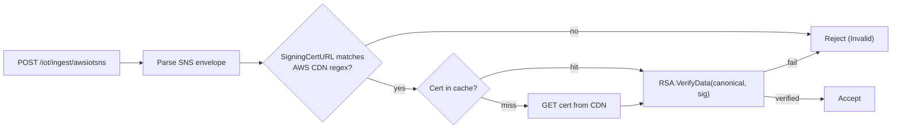

# Granit.IoT.Ingestion.Aws

AWS IoT Core ingestion provider for Granit.IoT.

Without this package, an application using Granit.IoT can ingest device
telemetry from Scaleway IoT Hub and from any MQTT broker — but not from AWS.
This package implements the three architecturally distinct HTTP paths AWS IoT
Core publishes to (SNS, direct HTTP, API Gateway) and plugs into the existing
provider-agnostic `POST /iot/ingest/{source}` endpoint. No new endpoints, no
new pipeline — just the validators, parsers, and the cert cache that AWS
specifically requires.

> [!NOTE]
> This first slice ships the **SNS path** only. SigV4 (Direct, API Gateway)
> and the message parsers land in follow-up commits — the package is designed
> as a vertical slice per HTTP path so each can be reviewed and shipped
> independently.

## What this slice ships

- `GranitIoTIngestionAwsModule` — depends on `GranitIoTIngestionModule` +
  `GranitCachingModule`; registers options, validator, cert cache, metrics
- `AwsIoTIngestionOptions` — three sub-sections (`Sns`, `Direct`, `ApiGateway`),
  each independently `Enabled`
- `AwsIoTIngestionOptionsValidator` (`IValidateOptions`) — fails startup when
  no path is enabled, when an enabled path lacks a region, or when a
  `Direct.ApiKey` is set in non-Development environments
- `ISnsSigningCertificateCache` + `DefaultSnsSigningCertificateCache` — fetches
  the AWS RSA signing cert once per `CertCacheHours`, backed by `IFusionCache`
  (from `Granit.Caching`)
- `SnsPayloadSignatureValidator` (`IPayloadSignatureValidator`,
  `SourceName = "awsiotsns"`) — RSA-SHA256 verification, replay dedup,
  topic-ARN allow-list, optional auto-confirmation of `SubscriptionConfirmation`
- `AwsIoTIngestionMetrics` — OpenTelemetry counters
  (`granit.iot.aws.ingestion.sns.*`)
- `SnsSigningCertFetchException` — surfaced as `503 Service Unavailable` by
  the endpoint layer

## Two layers of cert security



1. **CDN allow-list** — the cert URL must match
   `https://sns.{region}.amazonaws.com/SimpleNotificationService-*.pem`
   (a `[GeneratedRegex]` checked **before** any HTTP call). An attacker who
   controls the SNS message body cannot redirect us to fetch their own cert.
2. **RSA-SHA256** — `RSA.VerifyData(canonical, sig, SHA256, Pkcs1)` against
   the cached public key. Failure invalidates the cached entry so the next
   request re-fetches (covers AWS key rotation).

## Setup

```csharp
builder.Services
    .AddGranit(builder.Configuration)
    .AddModule<GranitIoTModule>()
    .AddModule<GranitIoTIngestionModule>()
    .AddModule<GranitIoTIngestionAwsModule>();

app.MapGranitIoTIngestionEndpoints();
// AWS SNS deliveries hit POST /iot/ingest/awsiotsns
```

## Configuration

```jsonc
{
  "IoT": {
    "Ingestion": {
      "Aws": {
        "Sns": {
          "Enabled": true,
          "Region": "eu-west-1",
          "TopicArnPrefix": "arn:aws:sns:eu-west-1:123456789012:iot-",
          "AutoConfirmSubscription": false,
          "CertCacheHours": 24,
          "DeduplicationWindowMinutes": 5
        },
        "Direct": { "Enabled": false, "Region": "" },
        "ApiGateway": { "Enabled": false, "Region": "" }
      }
    }
  }
}
```

| Setting | Default | Purpose |
| --- | --- | --- |
| `Sns:Enabled` | `false` | Master switch for the SNS path |
| `Sns:Region` | _(required when enabled)_ | Used by future paths and for cert URL hostname checks |
| `Sns:TopicArnPrefix` | `null` | Optional fast-fail filter — reject foreign topics before RSA work |
| `Sns:AutoConfirmSubscription` | `false` | Fire-and-forget GET to `SubscribeURL` on `SubscriptionConfirmation` |
| `Sns:CertCacheHours` | `24` | Per-cert TTL in `IFusionCache` |
| `Sns:DeduplicationWindowMinutes` | `5` | Replay window per `MessageId` (matches SNS at-least-once SLA) |

> [!IMPORTANT]
> `Direct:ApiKey` MUST NOT be set in `appsettings.{Production}.json`. The
> options validator fails startup if it finds a value outside the
> `Development` environment. Load it from `Granit.Vault` at runtime and bind
> via `IOptionsMonitor<AwsIoTIngestionOptions>` — secret rotations apply
> without restart.

## Anti-patterns to avoid

> [!WARNING]
> **Don't widen the CDN regex** to accept arbitrary `.amazonaws.com` paths.
> The pattern is a security boundary; an attacker who controls the SNS
> message body could otherwise host a malicious cert at any S3 bucket and
> bypass signature verification.

> [!WARNING]
> **Don't disable replay dedup to "improve throughput".** SNS guarantees
> at-least-once delivery; the 5-minute window protects against double
> ingestion, not against bad actors.

> [!CAUTION]
> **`SubscriptionConfirmation` auto-confirmation is opt-in for a reason.**
> Auto-confirming a subscription accepts the contract that the subscribed
> topic publishes to your endpoint. Leave `AutoConfirmSubscription = false`
> in production unless you control the SNS topic policy too.

## See also

- [`Granit.IoT.Ingestion`](../Granit.IoT.Ingestion/README.md) — the pipeline this provider plugs into
- [`Granit.IoT.Ingestion.Scaleway`](../Granit.IoT.Ingestion.Scaleway/README.md) — sister provider, same shape
- [Telemetry ingestion deep dive](../../docs/telemetry-ingestion.md) — end-to-end flow
